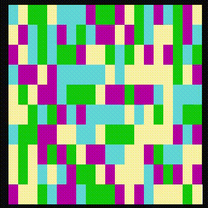

# Тестовое задание "Colonizer"

Цель тестового задания - стать первым шагом сектанта в мир C#. В ходе его выполнения вы сможете закрепить свои знания о C# на практике. Полезную информацию для выполнения можно найти по ссылкам в нашей роадмапе - https://github.com/kysect/Main/blob/master/roadmap/csharp.md.

Для отправки на ревью нужно создать репозиторий на гитхабе, загрузить в основную ветку пустой солюшен, а в отдельную ветку (назвать её можно произвольно, например, dev) загрузить решение и после этого отправить пул-реквест. Если вы мало знакомы с гитхабом, можно начать с [этого гайда](../articles/working-with-github/README.md). Когда задание будет выполнено, его будут ревьюить менторы секты, которые смогут дать фидбек и посоветовать изучить что-то дополнительно, чтобы закрыть пробелы в существующих знаниях.

## Glossary

- Поле - прямоугольный участок консоли, который зарисовывается цветами в ходе работы приложения.
- Пиксель - элемент поля.
- Пространство - множество пикселей одинакового цвета, которые связаны между собой общей гранью или другим пикселем.

## Этап 1. Реализация отрисовки поля

1. Реализовать код для отрисовки поля. Поле состоит из множества пикселей, которые должны принимать случайный цвет;
2. Реализовать возможность задавать множество цветов, из которого выбирается случайный цвет;
3. Реализовать возможность задавать размер поля.

Дополнительная информация:

- При указании большого размера поля можно получить ошибку выхода за пределы консоли. Это связано с тем, что размер открытой консоли может быть меньше поля. Решить эту проблему можно, если указать ожидаемого размера консольного окна через `Console.SetWindowSize()` (работает только на Windows) или заранее растянуть окно консоли;
- Доступные цвета для консоли определены в перечислении `ConsoleColor`, получить их список можно через `Enum.GetValues<ConsoleColor>()`;
- При работе со случайными значениями стоит использовать класс `Random`, но не нужно создавать его экземпляры - есть статическое поле `Random.Shared`;
- В базовой библиотеке нет методов, которые позволяют рисовать пикели в консоли. Такую логику можно реализовать меняя цвет консоли (`Console.BackgroundColor = ConsoleColor.XXX`) и рисуя пробелы на этом цвете (`Console.Write(' ')`). Чтобы "очистить" консоль от текущего цвета, после отрисовки пробела нужно поставить знчение `Console.BackgroundColor` в исходный цвет консоли. Для отрисовки "пикселя" в конкретном месте есть метод `Console.SetCursorPosition(x, y)`, а для отчистки консоли - `Console.Clear()`.

## Этап 2. Введение пространств

1. Реализовать алгоритм поиска всех пространств на поле;
2. Реализовать логику поиска смежных пикселей для каждого пространства.

Дополнительная информация:

- Для поиска пространств можно использовать DFS;
- Для пикселя смежными пикселями считаются 4 пикселя с которыми он имеет общую грань. Исключением являются пиксели, которые находятся по краям поля;
- Для пространства смежными пикселями считаются все те пиксели, которые являются смежными для любого из пикселей пространства. Множество смежных с пространством пикселей можно визуально представить как границы этого пространства.

## Этап 3. Мутация

1. Реализовать алгоритм мутации. Каждый шаг мутации заключается в том, что каждое пространство выбирает случайный смежный пиксель и красит его в свой цвет;
2. Реализовать перегенерацию и перерисовку поля после каждого шага мутации;
3. Потестировать на квадрате 30х30, осознать проблемность перерисовки и реализовать инкрементальную перерисовку поля.

- Для того, чтобы наблюдать за изменениями, проще всего написать в Program.Main `while(true)` и добавить в него `Console.ReadKey()`. Тогда можно тыкать пробел и смотреть, как происходит одна итерация. Когда станет ясно, что всё хорошо, можно заменить ReadKey на `Thread.Sleep(400)` (это приостановит выполнение программы на 400 миллисекунд);
- Инкрементальная прорисовка подразумевает, что нужно сохранить поле, которое было прорисовано на прошлом этапе. Не стоит пытаться доставать текущий цвет консоли, лучше научиться клонировать данные поля.

## Этап 4. Дополнительные задачи

- Реализовать возможность задавать скейл пикселей. Например, задаём поле 10х10 и скейлинг х2. В итоге логических пикселей будет 100, но рисовать на консоль нужно поле 20х20, каждый пиксель будет занимать 2х2 символов консоли;
- Добавить вероятность мутации. Пространство может мутировать с какой-то вероятностью, которая зависит от его размера. В зависимости от того, как именно задаются эти правила, поле красится очень разными стратегиями.

## Пример результата

