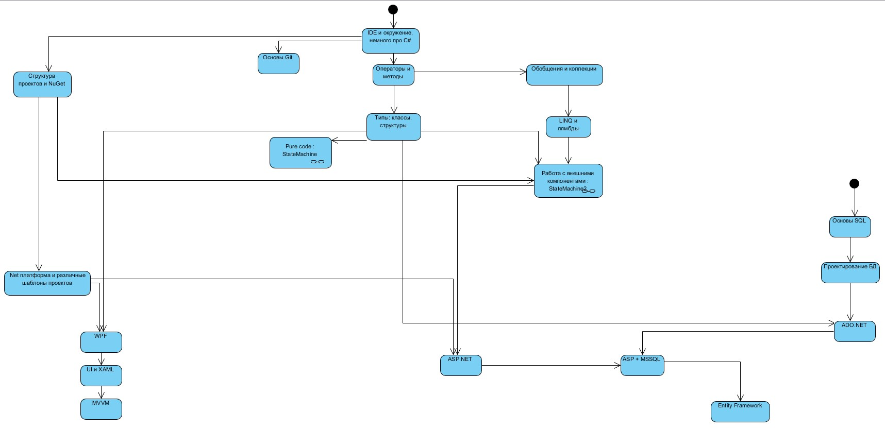

# IDE и окружение, немного про C# (id-1.1)

- Visual Studio, инфа про разные сборки и просто компоненты
  - Установка Visual Studio [link](https://docs.microsoft.com/ru-ru/visualstudio/install/install-visual-studio?view=vs-2019)
  - Гайд по VS, создание проекта [link](https://docs.microsoft.com/ru-ru/visualstudio/get-started/csharp/visual-studio-ide?view=vs-2019)
  - Немного про .Net [Метанит](https://metanit.com/sharp/tutorial/1.1.php)

# Операторы и методы (id-1.2)
- Язык C#, как и зачем
  - Базовые типы данных, понятие "переменная" [(Метанит)](https://metanit.com/sharp/tutorial/2.1.php)
  - Консольный ввод-вывод [(Метанит)](https://metanit.com/sharp/tutorial/2.15.php)
- Операторы (Арифметические, условные, циклы) [Албахари, глава 2]
  - Арифметические операции [(Метанит)](https://metanit.com/sharp/tutorial/2.3.php) [(CCT)](https://www.completecsharptutorial.com/basic/assignment-operators.php)
  - Условные выражения [(Метанит)](https://metanit.com/sharp/tutorial/2.24.php)
  - Условные конструкции [(Метанит)](https://metanit.com/sharp/tutorial/2.5.php)
  - Циклы [(Метанит)](https://metanit.com/sharp/tutorial/2.6.php)
- Массивы [(Метанит)](https://metanit.com/sharp/tutorial/2.4.php)
- Методы, параметры
  - Методы [(Метанит)](https://metanit.com/sharp/tutorial/2.8)
  - Параметры методов [(Метанит)](https://metanit.com/sharp/tutorial/2.9.php)
  - Передача параметров [(Метанит)](https://metanit.com/sharp/tutorial/2.27.php)
  - params [(Метанит)](https://metanit.com/sharp/tutorial/2.27.php)
  - Область видимости [(Метанит)](https://metanit.com/sharp/tutorial/2.18.php)
- Строки
  - Строки и класс System.String https://metanit.com/sharp/tutorial/7.1.php
  - Операции со строками https://metanit.com/sharp/tutorial/7.2.php

## Практика
1. Калькулятор (ReadLine + Split + if/elseif)
2. Перевод в римские числа
3. Курс алгоритмов от ИТМО

# Типы: классы, структуры. Основы ООП (id-1.3)
- Классы / Структуры [Албахари, глава 3]
  - Классы [(Метанит)](https://metanit.com/sharp/tutorial/3.1.php)
  - Структуры https://metanit.com/sharp/tutorial/2.13.php
  - Типы значений и ссылочные типы https://metanit.com/sharp/tutorial/2.16.php
- Особенности типов (??)
  - Модификаторы доступа https://metanit.com/sharp/tutorial/3.2.php
  - Свойства и инкапсуляция https://metanit.com/sharp/tutorial/3.4.php
  - Перегрузка методов https://metanit.com/sharp/tutorial/3.5.php
  - Статические члены и модификатор static https://metanit.com/sharp/tutorial/3.6.php
  - Константы и поля для чтения https://metanit.com/sharp/tutorial/3.3.php
  - Перегрузка операторов https://metanit.com/sharp/tutorial/3.36.php
  - Значение null https://metanit.com/sharp/tutorial/3.26.php
  - Индексаторы https://metanit.com/sharp/tutorial/4.10.php
- Основы ООП [Албахари, глава 3]
  - Наследование https://metanit.com/sharp/tutorial/3.7.php
  - Преобразование типов https://metanit.com/sharp/tutorial/3.11.php
  - Перегрузка операций преобразования типов https://metanit.com/sharp/tutorial/3.37.php
  - Виртуальные методы и свойства https://metanit.com/sharp/tutorial/3.19.php
  - Сокрытие https://metanit.com/sharp/tutorial/3.41.php
  - Абстрактные классы и члены классов https://metanit.com/sharp/tutorial/3.8.php
- Класс System.Object и его методы
  - https://metanit.com/sharp/tutorial/3.10.php
- Интерфейсы
  - https://metanit.com/sharp/tutorial/3.9.php

## Практика
1. Лабораторные за 2 семестр
2. Лабораторные за 3 семестр (1, 2, 6)

# Pure Code

# Обобщения и коллекции. LINQ и лямбды
- Обобщения
  - Обобщения [(Метанит)](https://metanit.com/sharp/tutorial/3.12.php)
  - Ограничения обобщений [(Метанит)](https://metanit.com/sharp/tutorial/3.38.php)
- Коллекции
  - Введение в коллекции [(Метанит)](https://metanit.com/sharp/tutorial/4.1.php)
  - Обобщенные коллекции [(Метанит)](https://metanit.com/sharp/tutorial/4.4.php)
  - Список List<T> [(Метанит)](https://metanit.com/sharp/tutorial/4.5.php)
  - Коллекция Dictionary<T, V> [(Метанит)](https://metanit.com/sharp/tutorial/4.9.php)
  - Интерфейсы IEnumerable и IEnumerator [(Метанит)](https://metanit.com/sharp/tutorial/4.11.php)
- Делегаты, лямбды
  - Делегаты [(Метанит)](https://metanit.com/sharp/tutorial/3.13.php)
  - События [(Метанит)](https://metanit.com/sharp/tutorial/3.14.php)
  - Анонимные методы [(Метанит)](https://metanit.com/sharp/tutorial/3.15.php)
  - Лямбды [(Метанит)](https://metanit.com/sharp/tutorial/3.16.php)
  - Делегаты Action, Predicate и Func [(Метанит)](https://metanit.com/sharp/tutorial/3.33.php)
- Методы расширения [(Метанит)](https://metanit.com/sharp/tutorial/3.18.php)
- LINQ
  - LINQ [(Метанит)](https://metanit.com/sharp/tutorial/15.1.php)
  - Фильтрация выборки и проекция [(Метанит)](https://metanit.com/sharp/tutorial/15.2.php)
  - Сортировка [(Метанит)](https://metanit.com/sharp/tutorial/15.3.php)
  - Работа с множествами [(Метанит)](https://metanit.com/sharp/tutorial/15.4.php)
  - Агрегатные операции [(Метанит)](https://metanit.com/sharp/tutorial/15.5.php)
  - Методы Skip и Take [(Метанит)](https://metanit.com/sharp/tutorial/15.11.php)
  - Группировка [(Метанит)](https://metanit.com/sharp/tutorial/15.6.php)
  - Методы All и Any [(Метанит)](https://metanit.com/sharp/tutorial/15.10.php)
  - Отложенное и немедленное выполнение LINQ [(Метанит)](https://metanit.com/sharp/tutorial/15.8.php)
  - Делегаты и анонимные методы в запросах LINQ [(Метанит)](https://metanit.com/sharp/tutorial/15.9.php)

# Работа с внешними компонентами

# Дебагинг (id-2.2)
# SOLID, паттерны (id-2.4)
# Многопоточность, асинхронность (id-2.5)
# Алсо

# Exception, работа с исключениями (id-2.1)
- Обработка исключений https://metanit.com/sharp/tutorial/2.14.php
- Блок catch и фильтры исключений https://metanit.com/sharp/tutorial/2.28.php
- Типы исключений. Класс Exception https://metanit.com/sharp/tutorial/2.29.php
- Создание классов исключений https://metanit.com/sharp/tutorial/3.17.php
- Поиск блока catch при обработке исключений https://metanit.com/sharp/tutorial/2.30.php
- Генерация исключения и оператор throw https://metanit.com/sharp/tutorial/2.31.php

# Полезные фичи C#
- Перечисления enum
  - https://metanit.com/sharp/tutorial/2.12.php
- Кортежи
  - https://metanit.com/sharp/tutorial/2.19.php
- Анонимные типы
  - https://metanit.com/sharp/tutorial/3.20.php
- Pattern matching
  - https://metanit.com/sharp/tutorial/3.34.php
- Nullable-типы
  - https://metanit.com/sharp/tutorial/2.17.php
- Строки
  - Форматирование и интерполяция строк https://metanit.com/sharp/tutorial/7.5.php
  - Класс StringBuilder https://metanit.com/sharp/tutorial/7.3.php
- Структура DateTime
  - Структура DateTime https://metanit.com/sharp/tutorial/19.1.php
  - Форматирование дат и времени https://metanit.com/sharp/tutorial/19.2.php

- Какой-то тестик https://itproger.com/tests