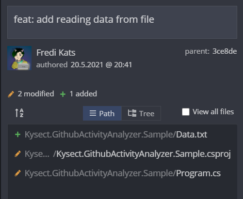
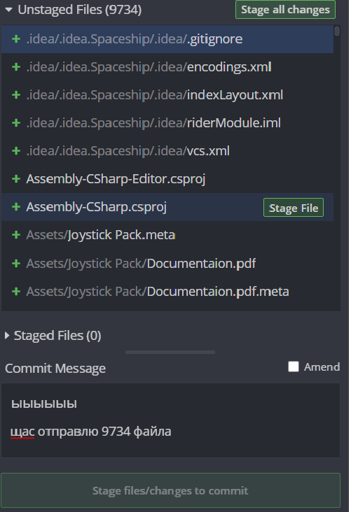

# Commits

Итак, у нас имеется настоящий Git-репозиторий и рабочая копия файлов для некоторого проекта. Нам нужно делать некоторые изменения и фиксировать эти изменения в вашем репозитории каждый раз, когда проект достигает состояния, которое нам хотелось бы сохранить. Каждая подобная фиксация является коммитом.

Commit - это снимок текущего репозитория и набор метаданных, которые были сохранены во время создания.

Не стоит пихать всё подряд в один огромный коммит - гораздо лучше разнести их на несколько коммитов поменьше, каждый из которых будет отвечать за то или иное изменение в проекте.

Пример хорошего коммита



Пример плохого коммита



## Commits naming

Commit содержит message, который прописывается во время создания. Есть ряд рекомендаций, который стоит придерживаться при нейминге. Основные пункты:

- Сообщение комита должно отображать сделанные изменения
  - Хорошо: `Fix queue ordering algorithm`
  - Плохо: `Close bug #12321`
- Сообщение должно начинаться с "imperative present active verb" (c)
  - Хорошо: `Fix`, `Refactor`, `Optimize`
  - Плохо: `Refactoring`, `Fixed`, `Optimizes`
- Сообщение должно начинаться с большой буквы
- Не используйте точку в конце сообщения (только в гите (!))
- Не пишите сообщение больше 50 символов. Желание написать длинное сообщение может быть связано с попыткой закомитить сразу больше одного действия. Имеет смысл декомпозировать

Сильно может помочь набор префиксов. Но стоит относиться к этому, как к примеру часто используемых префиксов:

- Add feature for a user to like a post
- Drop feature for a user to like a post
- Fix association between a user and a post
- Bump dependency library to current version
- Make build process use caches for speed
- Optimize search speed for a user to see posts
- Document community guidelines for post content
- Refactor user model to new language syntax
- Reformat home page text to use more whitespace

Что почитать:

- Статьи по запросу "semantic commit message"
- https://gist.github.com/joshbuchea/6f47e86d2510bce28f8e7f42ae84c716
- https://cbea.ms/git-commit/

Как могла бы выглядеть история случайно взятого репозитория:

```
Add entities for AW
Add support for JOIN with WHERE
Remove unused entities from serialization project
Rename OrmTask to QueryData
Document new library API
Add new project for tests
Reformat issue template
Remove outdated to-do's
Add support for ADO 
Refactor table join logic
Fix missed brackets in alias
```

## Commit author

Помимо явно указанных данных (изменения и commit message) есть те, которые прописываются неявно. Например - имя и почта автора. Эта данные содержатся во всех коммитах, а данные берутся из конфигурации git'а. Явно задать значения можно командами:

```
git config --global user.name "FIRST_NAME LAST_NAME"
git config --global user.email "MY_NAME@example.com"

```

Указывать правильную почту важно в том числе для того, чтобы GitHub мог сопоставлять коммиты с аккаунтов на GitHub'е. Это делается путём сопоставления почты автора в коммите и добавленных почт в аккаунт.
