# Работа с Git + Github: Для самых маленьких

<!-- TABLE OF CONTENTS -->

 

<ol>
 <li><a href="#что-такое-git">Что такое Git?</a></li>
        <ul>
          <li><a href="#репозиторий">Репозиторий</a></li>
          <li><a href="#коммиты-и-комменты">Коммиты и комменты</a></li>
          <li><a href="#ветки-и-pull-request">Ветки и pull request</a></li>
          <li><a href="#gitignore">Немного о .gitignore</a></li>
        </ul>
  <li><a href="#варианты-работы-с-git">Варианты работы с Git</a></li>
        <ul>
          <li><a href="#gitkraken">GitKraken</a></li>
          <li><a href="#visual-studio">Visual Studio</a></li>
          <li><a href="#ide-от-jetbrains">IDE от JetBrains</a></li>
        </ul>
  <li><a href="#что-почитать">Что почитать?</a></li>
</ol>

## Система контроля версий

Система контроля версий (VCS) - это инструмент, который позволяет управлять изменениями. Для упрощения будем считать, что VCS работает с какой-то директорией и отслеживает изменения внутри неё - добавленные, изменённые или удалённые файлы и поддиректории (далее "объектов").

Базовые операции VCS:

- Фиксация текущего состояния объектов. После фиксации в системе останется запись о том, в каком состоянии находился каждый объект;
- Отслеживание изменений. VCS отслеживает и может предоставить информацию о том, как изменился объект сравнивая его с состояние в момент прошлой фиксации;
- Откатывание изменений. VCS позволяет вернуться к состоянию последней фиксации откатив изменения;
- Откатывание к прошлым фиксациям. VCS позволяет работать не только с последней фиксацией, но и возвращать состояние директории в момент любой существующей фиксации.

Плюсы применения VCS:

- Есть возможность увидеть изменения текущей итерации, провести ревью только новых изменений, а не всего кода;
- Если во время изменения стало понятно, что всё пошло не туда и нужно откатиться, наличие фиксаций позволяют откатываться к определённому моменту, а не начинать всё с нуля;
- Работая с кодом, можно вернуться в состояние в прошлом, запустить, посмотреть и сравнить;
- VCS предоставляет историю фиксаций. В любой момент можно посмотреть когда и кем изменялся отдельно взятый файл или директория в целом.

## VCS для нескольких пользователей

Основной сценарий использования VCS - это совместная работа над проектом многими пользователями одновременно. Есть два основных подхода:

Централизованные VCS. Идея в том, что есть основной экземпляр VCS, где храниться информация о всех изменениях. Когда пользователю нужно начать работать с системой, он подключается к VCS, выгружает данные локально и начинает работать. Когда изменения локально внесены, пользователь отправляет основному экземпляру VCS запрос на фиксацию изменений.

Децентрализованные VCS. Основное отличие в том, что пользователь получает возможность работать с VCS локально и независимо. Пользователь перед началом работы с VCS копирует себе всю метаинформацию об изменениях. В Децентрализованных VCS есть понятие репозиторий - это и есть этот набор файлов и метаданных. Пользователь может добавлять в свою копию репозитория фиксации. Синхронизация между пользователями происходит за счёт дальнейших слияний этих независимых репозиториев. У децентрализованных VCS обычно есть основной экземпляр, пользователи синхронизируют свои изменения с ним.

## Репозитории

Далее под VCS будет подразумеваться git и примеры работы будут с использованием git'а. Git - это децентрализованная VCS.

Репозитории можно поделить на две категории:

- Local. Это репозиторий, с которым пользователь работает. Он был либо создан пользователем локально, либо был склонирован из другого репозитория;
- Remote. Это репозитории, которые находятся на удалённой ноде, которая предоставляем возможность синхронизировать с ней репозиторий. Примером является GitHub - он даёт возможность создавать репозиторий на их серверах и с помощью HTTP запросов выполнять операции - клонирование remote repository (а значит создание локальной копии), синхронизация (ряд операций, который синхронизируют local и remote repositories). Важно понимать, что remote репозиторий ничем не отличается от local с точки зрения наполнения - это такой же набор файлов и метаданных идентичный тому, что получит пользователь при клонировании.

Как получить local repository, который ассоциирован в remote:

- Вариант 1. Создать локально директорию, инициализировать её как git repository (git init). После чего перейти в сервис, который предоставляет возможность загружать remote repository (GitHub, GitLab, Azure DevOps), получить ссылку на место для загрузки репозитория (это HTTP или SSH ссылка). После чего можно добавить в локальный репозиторий информацию о remote repository (git remote).
- Вариант 2. Создать сначала ремоут репозиторий, склонировать его локально и работать с ним.

После добавления remote репозитория в метаданных local репозитория будет хранится метаинформация и local и remote репозитория. Не смотря на то, что после добавления remote repository в local repository, они не синхронизируются автоматически. Может случиться такая ситуация, когда в local создаются коммиты и не попадают в remote или наоборот. Есть две основные операции для синхронизации:

- push - это отправка коммитов из локального репозитория в remote
- pull - это получение последней версии remote репозитория

## Github repository

Про подробное устройство репозитория и то, как он работает внутри, можно почитать тут https://git-scm.com/book/ru/v2/

Github - соцсеть для программистов: тут можно легко передавать, хранить и получать самую актуальную информацию.

Также на Github есть деление на private и public репозитории. Public репозитории доступны всем желающим, а Private только вам и тем, кому вы предоставите эту возможность.

Для управления репозиторием на Github необходимо перейти во вкладку Settings

Если вы хотите сделать репозиторий приватным\публичным или удалить его, скролльте вниз до Danger zone
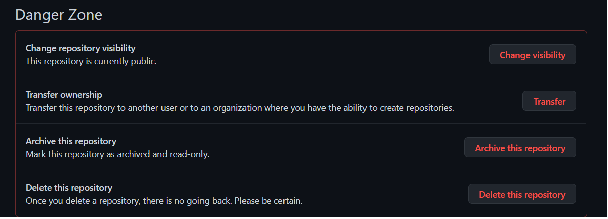

Если вы хотите добавить кого-то в приватный репозиторий, вам поможет вкладка manage access
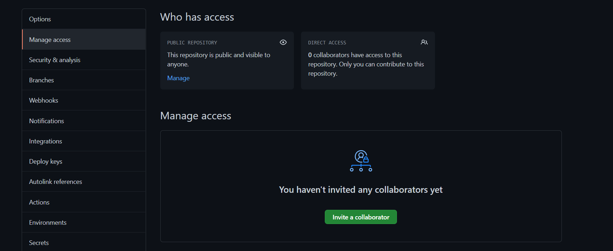

## Коммиты и комменты

Итак, у нас имеется настоящий Git-репозиторий и рабочая копия файлов для некоторого проекта. Нам нужно делать некоторые изменения и фиксировать эти изменения в вашем репозитории каждый раз, когда проект достигает состояния, которое нам хотелось бы сохранить.

Каждая подобная фиксация является коммитом. 

Не стоит пихать всё подряд в один огромный коммит - гораздо лучше разнести их на несколько коммитов поменьше, каждый из которых будет отвечать за то или иное изменение в проекте.

Пример хорошего коммита

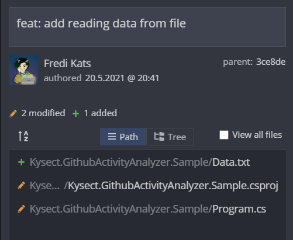

Пример плохого коммита

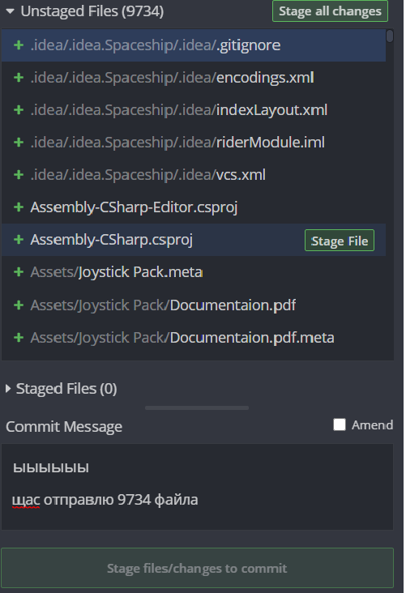

## Ветки и pull request
Предположим, вы захотели добавить какую-то фичу в проект. Казалось бы - пиши код, делай коммиты, если что - откатимся. 
Вы, как добропорядочный программист, фиксируете все изменения и пушите их на Github. Ваши товарищи тоже не сидят сложа руки, и каждый делает то же самое. Вы все работаете над разными задачами одного проекта и ежечасно подгружаете чужие изменения, параллельно  добавляя свои. 
И вдруг в какой-то момент вы понимаете, что ваша фича не работает, и всё очень плохо, и лучше бы вернуть всё, как было... Но вот незадача: помимо ваших изменений откатятся и изменения других людей, а там всё было хорошо.

Именно для этого в git используют ветки. Основная ветка называется master\main, и там хранится текущая версия проекта, где всё точно работает как надо. Помимо главной ветки проекта мы можем добавлять новые "ответвления" для решения каких-либо задач. Между ветками можно переключаться (об этом чуть позднее), так что если все ваши изменения куда-то пропали - возможно вы просто находитесь в другой ветке. С помощью этого механизма каждая задача может решаться независимо от других, а после того как мы убедимся, что она решена, можно снова соединить нашу ветку и master. 

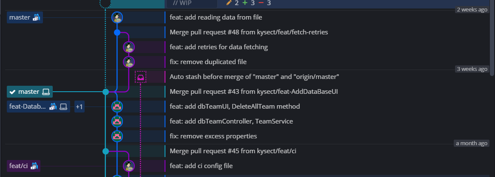

Однако все мы иногда допускаем ошибки. Поэтому прежде чем слить все наши изменения в master, неплохо было бы чтобы кто-то проверил чего мы там наковыряли. Когда вы сделаете push находясь в новой ветке, Github предложит создать pull request, где ваши изменения могут посмотреть, исправить, или оставить какие-то комментарии к ним, прежде чем они будут влиты в master. Кроме того, все изменения, которые вы запушите из той же ветки, будут так же попадать в этот пулл реквест до тех пор, пока он не закроется. (Иными словами, если вы открыли pull request, вам сказали что нужно поправить пару деталей - смело поправляейте и жмите push, все изменения автоматически попадут в этот pull request)
Выглядит это примерно вот так:
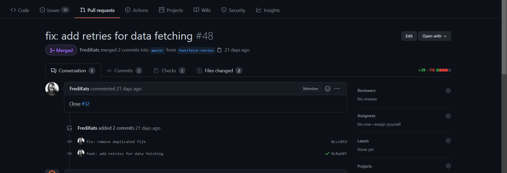

## Варианты работы с Git
Для новичков я рекомендую использовать **GUI GitKraken** (https://www.gitkraken.com/), это тот же консольный Git, но только в красивой и интуитивно понятной оболочке. Однако при желании можно воспользоваться встроенными средствами IDE.

### GitKraken
Для работы с Git первым делом необходимо создать репозиторий.

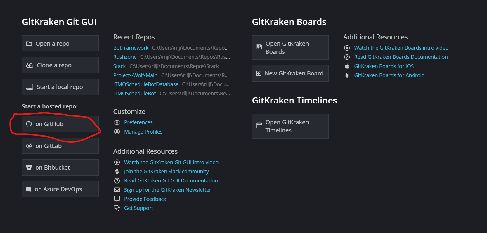

Далее нам необходимо выбрать Github и создать наш репозиторий. **Обратите внимание на настройки доступа**: закрытый репозиторий (private) и открытый (public). Также стоит обратить внимание на **gitignore файл**, он должен соответствовать вашей **среде разработки** (в моём случае - Visual Studio). 

Не забываем о .gitignore!

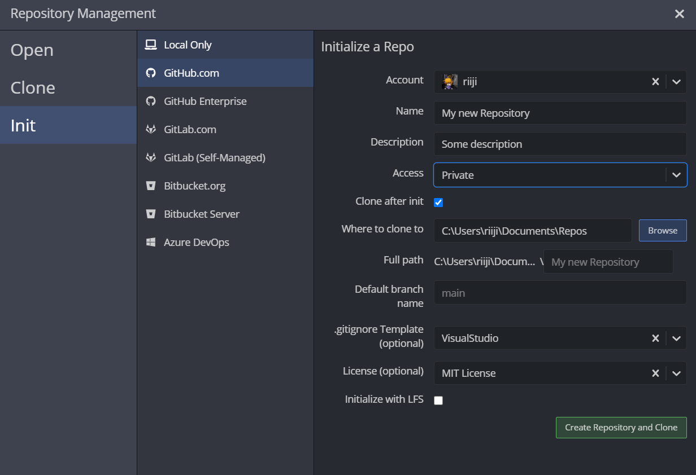

Кидаем проект в **папку с репозиторием**, папка должна выглядеть примерно так
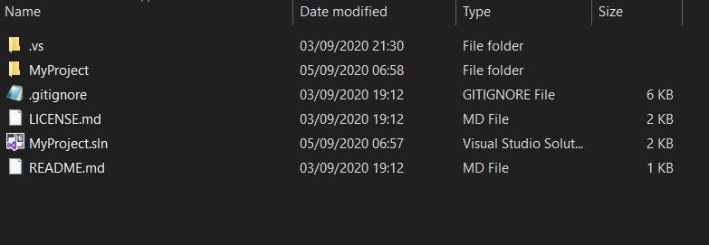

В самом GitKraken'e справа **должны появиться изменения**, из всех файлов важными оказались только 3, значит gitignore сработал правильно, называем и делаем commit

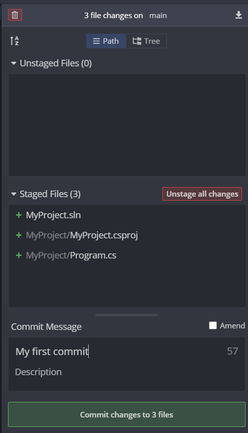

Ну вот мы и пришли к последнему этапу: дело в том, что при создании коммита мы никуда ничего не отправили, изменения сохранились только на нашем локальном компьютере, то есть никаких изменений в репозиторий на Github'e мы не внесли. Для того, чтобы наши изменения появились в репозиторие на Github'e, необходимо в клиенте GitKraken'a нажать кнопку **Push.**

На этом всё, далее вы можете работать над вашим проектом. GitKraken будет сам отслеживать изменения в коде, необходимо только делать Commit+Push для обновления информации на Github

## Альтернативный способ:

Конечно же, есть и другие способы создания репозитория. Например, можно создать проект в Visual Studio с локальным гитом
(мануал как это сделать https://vk.cc/azdQtZ)

Далее открываем папку с проектом через GitKraken и делаем remote

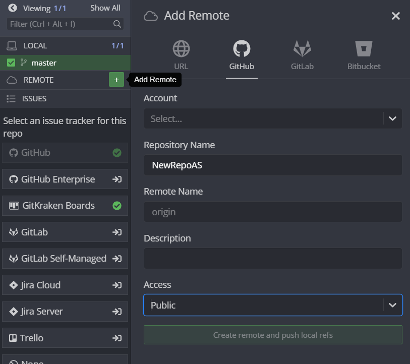

Делаем уже привычные commit+push, и наши файлы теперь лежат на github

### Visual Studio
Итак, по какой-либо причине вы отказались от удобного UI и решили пользоваться встроенными средствами Visual Studio.
Вы работали над проектом и в какой-то момент решили добавить git репозиторий? Нет проблем - жмите на эту кнопку (да, у автора русская Visual Studio, и да, однажды он это исправит)
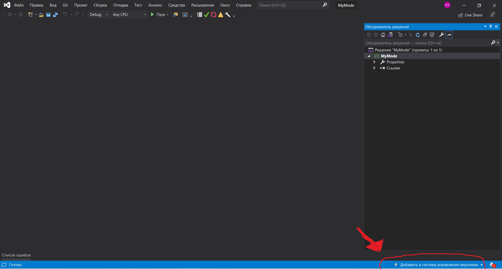

После этого вам будет предложено выбрать его настройки приватности, имя и месторасположение. Кроме того, если вы синхронизировались со своим аккаунтом на Github, у вас будет возможность автоматически создать репозиторий и там.
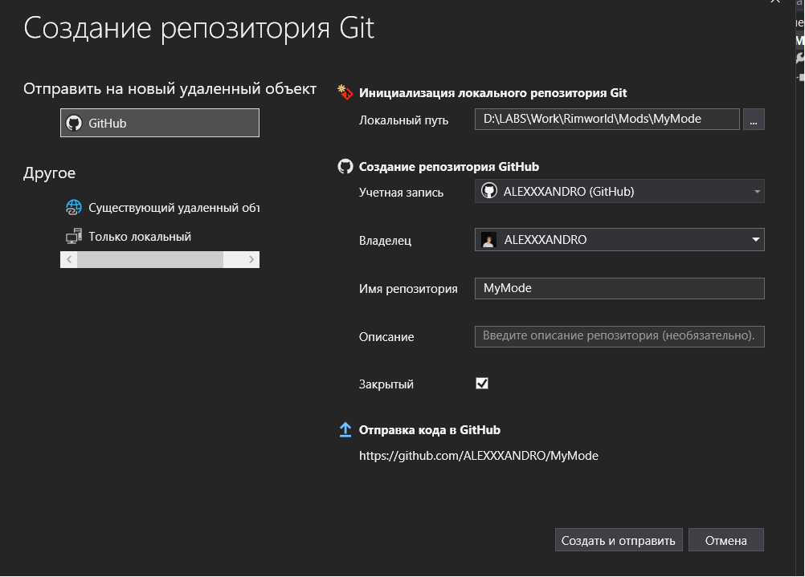

Кроме того, в "шапке" доступна следующая вкладка. В ней мы можем сделать коммит, запушить изменения на Github, получить чужие изменения и перейти в управление ветками 

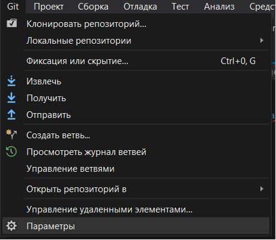 

После клика на "фиксация"/"commit" открывается следующее окошко. В нём мы и создаем наш коммит, после чего его можно запушить, нажав на соответствующую кнопку.

### IDE от JetBrains 
Во всех IDE от JetBrains работа с git устроена одинаковым образом. Мы же рассмотрим её на примере работы с Rider.

При создании проекта вам будет предложено автоматически создать git репозиторий. Если не ставить галочку, это можно будет сделать позднее во вкладке git.
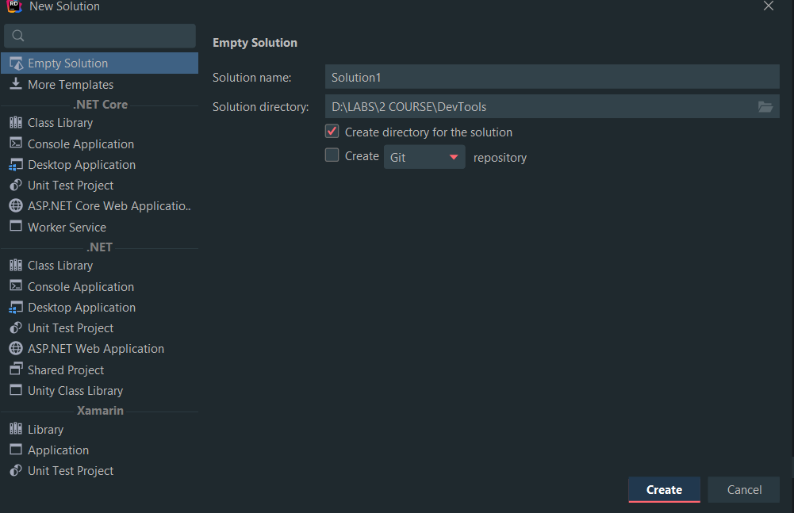

Для взаимодействия с git-oм непосредсвенно изнутри IDE нам понадобятся следующие кнопки. 
Синяя стрелочка (Pull) - выгрузить изменения из удалённого репозитория.
Зелёная галочка (Commit) - сделать коммит.
Зелёная стрелочка (Push) - запушить коммит на удалённый репозиторий.
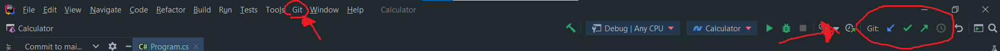

Кроме того, Intellij idea предоставляет относительно удобную работу с ветками, если вы по каким то причинам не хотите устанавливать Gitkraken. После клика на Branches во вкладке Git, перед нами появится следующее окошко, в котором мы можем создавать новые ветки (New branch), переходить между ветками (Checkout branch) и делать прочие непотребства

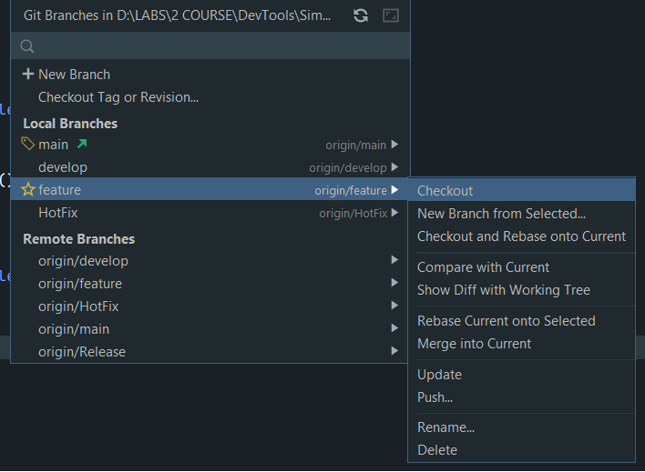

Также по клику на вкладку Git в правом нижнем углу экрана (она появится только если у вас уже есть Git репозиторий) можно открыть окошко с отрисовкой веток и возможностью перемещения по коммитам.

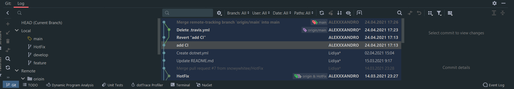

## Что почитать

https://git-scm.com/book/ru/v2/ (Всё о гите)

https://support.gitkraken.com/start-here/guide/

https://rogerdudler.github.io/git-guide/ (микрогайд по консольному гиту)

https://tproger.ru/translations/beginner-git-cheatsheet/
