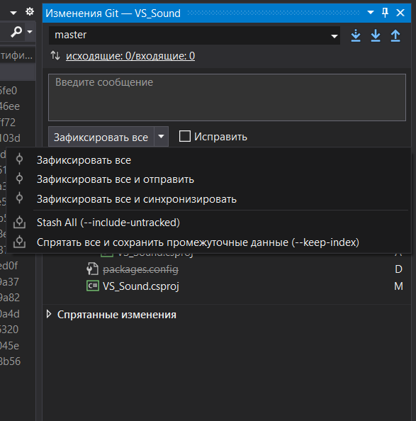

# Работа с Git + Github: Для самых маленьких

- [Работа с Git + Github: Для самых маленьких](#работа-с-git--github-для-самых-маленьких)
  - [Система контроля версий](#система-контроля-версий)
    - [VCS для нескольких пользователей](#vcs-для-нескольких-пользователей)
    - [Репозитории](#репозитории)
    - [Github repository](#github-repository)
  - [Commits](#commits)
    - [Commits naming](#commits-naming)
    - [Commit author](#commit-author)
    - [Ignoring files in git](#ignoring-files-in-git)
  - [Branching](#branching)
    - [Base branch merge](#base-branch-merge)
    - [Pull request](#pull-request)
    - [Conflict](#conflict)
    - [Коммиты и ветки](#коммиты-и-ветки)
  - [Варианты работы с Git](#варианты-работы-с-git)
    - [GitKraken](#gitkraken)
  - [Альтернативный способ:](#альтернативный-способ)
    - [Visual Studio](#visual-studio)
    - [IDE от JetBrains](#ide-от-jetbrains)
  - [Что почитать](#что-почитать)

## Система контроля версий

Система контроля версий (VCS) - это инструмент, который позволяет управлять изменениями. Для упрощения будем считать, что VCS работает с какой-то директорией и отслеживает изменения внутри неё - добавленные, изменённые или удалённые файлы и поддиректории (далее "объектов").

Базовые операции VCS:

- Фиксация текущего состояния объектов. После фиксации в системе останется запись о том, в каком состоянии находился каждый объект;
- Отслеживание изменений. VCS отслеживает и может предоставить информацию о том, как изменился объект сравнивая его с состояние в момент прошлой фиксации;
- Откатывание изменений. VCS позволяет вернуться к состоянию последней фиксации откатив изменения;
- Откатывание к прошлым фиксациям. VCS позволяет работать не только с последней фиксацией, но и возвращать состояние директории в момент любой существующей фиксации.

Плюсы применения VCS:

- Есть возможность увидеть изменения текущей итерации, провести ревью только новых изменений, а не всего кода;
- Если во время изменения стало понятно, что всё пошло не туда и нужно откатиться, наличие фиксаций позволяют откатываться к определённому моменту, а не начинать всё с нуля;
- Работая с кодом, можно вернуться в состояние в прошлом, запустить, посмотреть и сравнить;
- VCS предоставляет историю фиксаций. В любой момент можно посмотреть когда и кем изменялся отдельно взятый файл или директория в целом.

### VCS для нескольких пользователей

Основной сценарий использования VCS - это совместная работа над проектом многими пользователями одновременно. Есть два основных подхода:

Централизованные VCS. Идея в том, что есть основной экземпляр VCS, где храниться информация о всех изменениях. Когда пользователю нужно начать работать с системой, он подключается к VCS, выгружает данные локально и начинает работать. Когда изменения локально внесены, пользователь отправляет основному экземпляру VCS запрос на фиксацию изменений.

Децентрализованные VCS. Основное отличие в том, что пользователь получает возможность работать с VCS локально и независимо. Пользователь перед началом работы с VCS копирует себе всю метаинформацию об изменениях. В Децентрализованных VCS есть понятие репозиторий - это и есть этот набор файлов и метаданных. Пользователь может добавлять в свою копию репозитория фиксации. Синхронизация между пользователями происходит за счёт дальнейших слияний этих независимых репозиториев. У децентрализованных VCS обычно есть основной экземпляр, пользователи синхронизируют свои изменения с ним.

### Репозитории

Далее под VCS будет подразумеваться git и примеры работы будут с использованием git'а. Git - это децентрализованная VCS.

Репозитории можно поделить на две категории:

- Local. Это репозиторий, с которым пользователь работает. Он был либо создан пользователем локально, либо был склонирован из другого репозитория;
- Remote. Это репозитории, которые находятся на удалённой ноде, которая предоставляем возможность синхронизировать с ней репозиторий. Примером является GitHub - он даёт возможность создавать репозиторий на их серверах и с помощью HTTP запросов выполнять операции - клонирование remote repository (а значит создание локальной копии), синхронизация (ряд операций, который синхронизируют local и remote repositories). Важно понимать, что remote репозиторий ничем не отличается от local с точки зрения наполнения - это такой же набор файлов и метаданных идентичный тому, что получит пользователь при клонировании.

Как получить local repository, который ассоциирован в remote:

- Вариант 1. Создать локально директорию, инициализировать её как git repository (git init). После чего перейти в сервис, который предоставляет возможность загружать remote repository (GitHub, GitLab, Azure DevOps), получить ссылку на место для загрузки репозитория (это HTTP или SSH ссылка). После чего можно добавить в локальный репозиторий информацию о remote repository (git remote).
- Вариант 2. Создать сначала ремоут репозиторий, склонировать его локально и работать с ним.

После добавления remote репозитория в метаданных local репозитория будет хранится метаинформация и local и remote репозитория. Не смотря на то, что после добавления remote repository в local repository, они не синхронизируются автоматически. Может случиться такая ситуация, когда в local создаются коммиты и не попадают в remote или наоборот. Есть две основные операции для синхронизации:

- push - это отправка коммитов из локального репозитория в remote
- pull - это получение последней версии remote репозитория

### Github repository

Про подробное устройство репозитория и то, как он работает внутри, можно почитать тут https://git-scm.com/book/ru/v2/

Github - соцсеть для программистов: тут можно легко передавать, хранить и получать самую актуальную информацию.

Также на Github есть деление на private и public репозитории. Public репозитории доступны всем желающим, а Private только вам и тем, кому вы предоставите эту возможность.

Для управления репозиторием на Github необходимо перейти во вкладку Settings


Если вы хотите сделать репозиторий приватным\публичным или удалить его, скролльте вниз до Danger zone


Если вы хотите добавить кого-то в приватный репозиторий, вам поможет вкладка manage access


## Commits

Итак, у нас имеется настоящий Git-репозиторий и рабочая копия файлов для некоторого проекта. Нам нужно делать некоторые изменения и фиксировать эти изменения в вашем репозитории каждый раз, когда проект достигает состояния, которое нам хотелось бы сохранить. Каждая подобная фиксация является коммитом.

Commit - это снимок текущего репозитория и набор метаданных, которые были сохранены во время создания.

Не стоит пихать всё подряд в один огромный коммит - гораздо лучше разнести их на несколько коммитов поменьше, каждый из которых будет отвечать за то или иное изменение в проекте.

Пример хорошего коммита


Пример плохого коммита


### Commits naming

Commit содержит message, который прописывается во время создания. Есть ряд рекомендаций, который стоит придерживаться при нейминге. Основные пункты:

- Сообщение комита должно отображать сделанные изменения
  - Хорошо: `Fix queue ordering algorithm`
  - Плохо: `Close bug #12321`
- Сообщение должно начинаться с "imperative present active verb" (c)
  - Хорошо: `Fix`, `Refactor`, `Optimize`
  - Плохо: `Refactoring`, `Fixed`, `Optimizes`
- Сообщение должно начинаться с большой буквы
- Не используйте точку в конце сообщения (только в гите (!))
- Не пишите сообщение больше 50 символов. Желание написать длинное сообщение может быть связано с попыткой закомитить сразу больше одного действия. Имеет смысл декомпозировать

Сильно может помочь набор префиксов. Но стоит относиться к этому, как к примеру часто используемых префиксов:

- Add feature for a user to like a post
- Drop feature for a user to like a post
- Fix association between a user and a post
- Bump dependency library to current version
- Make build process use caches for speed
- Optimize search speed for a user to see posts
- Document community guidelines for post content
- Refactor user model to new language syntax
- Reformat home page text to use more whitespace

Что почитать:

- Статьи по запросу "semantic commit message"
- https://gist.github.com/joshbuchea/6f47e86d2510bce28f8e7f42ae84c716
- https://cbea.ms/git-commit/

Как могла бы выглядеть история случайно взятого репозитория:

```
Add entities for AW
Add support for JOIN with WHERE
Remove unused entities from serialization project
Rename OrmTask to QueryData
Document new library API
Add new project for tests
Reformat issue template
Remove outdated to-do's
Add support for ADO 
Refactor table join logic
Fix missed brackets in alias
```

### Commit author

Помимо явно указанных данных (изменения и commit message) есть те, которые прописываются неявно. Например - имя и почта автора. Эта данные содержатся во всех коммитах, а данные берутся из конфигурации git'а. Явно задать значения можно командами:

```
git config --global user.name "FIRST_NAME LAST_NAME"
git config --global user.email "MY_NAME@example.com"

```

Указывать правильную почту важно в том числе для того, чтобы GitHub мог сопоставлять коммиты с аккаунтов на GitHub'е. Это делается путём сопоставления почты автора в коммите и добавленных почт в аккаунт.

### Ignoring files in git

Системы контроля версий используются для отслеживания файлов, которые имеют ценность для репозитория. Такими являются не все файлы. Примером не нужных в системе контроля версий файлов можно назвать сгенерированные временные файлы. Например, во время компиляции и запуска C# проектов создаются директории bin/ и obj/, они хранят в себе временные файлы. Чтобы эти файлы не попали в репозиторий, а их изменения не забивали diff в pull request'е, их нужно игнорировать в git'е. Для этого есть .gitignore.

.gitignore - это специальный файл git'а, в котором можно указать список файлов и директорий, которые будут игнорироваться при трекинге изменений git'ом. Такой файл создаётся в корне git репозитория и применяется на него. Пример содержимого файла:

```
# Build results
[Dd]ebug/
[Rr]elease/
[Bb]in/
[Oo]bj/
[Ll]ogs/

*.db
```

Указанные в примере строчки в этом файле будут указывать git'у на то, что нужно игнорировать директории `Debug`, `Obj`, а также любые файлы с расширением `.db`. Обычно такой файл IDE генерирует при создании проекта. Если же файл не сгенерировался, можно найти примеры под нужную платформу и IDE и создать его самостоятельно. В репозитории https://github.com/github/gitignore лежат примеры gitignore файлов для различных языков, платформ и IDE. Оттуда можно скопировать пример для Visual studio и положить в корень проекта.

Но если так сложилось, что файлы уже попали в commit (не было в проекте .gitignore, закомитили изменения и потом добавили), то добавление .gitignore'а не приведёт к удалению и более того, файлы будут продолжать отслеживаться git'ом. Чтобы избавиться от таких файлов нужно:

1. Закрыть IDE и другие приложения, которые могут удерживать файлы или их генерировать;
2. Найти нужный .gitignore, добавить его в корень директории с репозиторием, закомитить;
3. Удалить все директории и файлы, которые не должны быть в git'е и закомитить изменения;
4. Убедиться, что при открытии IDE, компиляции и других действиях удалённые файлы не попадают в трекинг git'а

Дополнительный hard mode: для того, чтобы не только в будущем, а ещё и в прошлом не сталкиваться с не нужными файлами, можно воспользоваться git командами для удаления изменения из старых комитов - git filter-branch. Но стоит помнить, что изменения комита в прошлом - это буквально пересоздание его, а значит нужно будет делать force push, а изменения будут несовместимы с тем, что в параллель могли делать коллеги. И всегда есть возможность случайно убить всю историю.


## Branching

Ветки в git - это специальным образом сохранённые ссылки на определённый коммит.

Ветки в git позволяют создавать комиты изолированно от остальных веток. В дальнейшем можно между этими ветками переключатся сохраняя в каждой ветке тот стейт до которого разработка дошла. При создании репозитория, в нём автоматически создаётся основная ветка - master, которая может быть использована для фиксации изменений. Это достаточно, чтобы создавать новые коммиты и вести работу, но с ростом размера проекта и команды это становится не удобно. Какой именно подход по использованию веток выбрать зависит от размеров команды, проекта зависит и принятого workflow зависит.

Этап 1. В процессе разработки появится необходимость в ревью, CI и остальном. Чтобы реализовать накую возможность, нужно создавать отдельную ветку, чтобы от неё создавать pull request. В этот момент появляется необходимость в feature-ветках. Это такие ветки, которые создаются под написание одной новой фичи, одного изменений etc. Их время жизни заканчивается после мёрджа ветки в master. Такие ветки можно называть `feat/your-feature-name`. Аналогично можно сказать про фиксы.

Этап 2. По мере усложнения продукта и увеличения размера цикла разработки, появляется необходимость иметь стабильную ветку, с которой можно взять рабочую версию. Проблема в том, что изменения, которые вливаются с feature-веток, могут быть недостаточно протестированы. В такой ситуации имеет смысл выделить dev-ветку. Эта ветка будет использоваться во время разработки, в неё будут вливаться изменения. После того, как все нужные изменения влиты и протестированы, ветка dev вливается в мастер.

Этап 3. Есть сценарии, которые не вписываются в модель с master + dev ветками. Самый частых из них - это необходимость загрузить hotfix в master. Но если делать это через dev ветку, то могут попасть остальные изменения, которые нужно детально тестировать. Чтобы сократить время и исправить проблему ASAP вводят hotfix ветки, которые после верификации вливаются в master и dev ветки.

Этап 4. Если в проекте много разработчиков и они параллельно ведут работают над проектом, то в какой-то момент часть из них будет занята стабилизацией ветки dev и её подготовкой к слиянию. В то же время остальные будут продолжать разработку и вносить новые изменения в dev, тем самым усложняя работу первой группе. Чтобы избежать такой проблемы, имеет смысл выделить ветку release. Как только работы над веткой dev заканчиваются, от последнего комита создаётся ветка release и в ней происходит закрытие проблем и багой, которые мешают влить ветку dev в ветку master. Как только все проблемы устранены, ветка release вливается в master и в dev (он за время существования ветки release там могли появиться коммиты).

### Base branch merge

Рассмотрим частую ситуацию при разработке и использованием веток. В проекте существовала ветка master, от неё отбранчили две feature-ветки - feature-a и feature-b, в них начали создаваться коммиты. После этого ветку feature-a доделали и вмёрджили в master, а в ветке feature-b появилась необходимость использовать изменения из feature-a. Есть два варианта решения проблемы:

- rebase  - перенести изменения feature-b на последний коммит мастера после мёрджа
- merge master to feature-b - смёрджить изменения из ветки master в ветку, где этих изменений не хватает. Это не соответствует обычному workflow мёрджа, но такой мёрдж позволяет синхронизировать feature-ветку с её base-веткой.

### Pull request

Pull request - это механизм, который выходит за рамки git, но он есть во всех сервисах управления репозиториями (GitHub, Azure DevOps). Pull request - это запрос на влитие одной ветки в другую. Хорошим тоном является закрытие возможности делать push коммитов в master и единственным способом залить туда коммиты - это создание pull request'а. Pull request - это этап между созданием коммита и его попадания в мастер ветку, который позволяет задавать правила для merge операции:

- Возможность сконфигурировать GitHub Action и запускать билд и проверку всех тестов
- Возможность сконфигурировать GitHub Action и запускать анализатор кода (например, SonarCloud)
- Возможность повесить требование на обязательное ревью перед merge

Если эти требования не соблюдаются, то GitHub не будет давать возможности выполнить pull request merge.

### Conflict

При параллельной работе с репозиторием может оказаться ситуация, когда два pull request'а меняют одинаковые строчки. Система контроля версий не может за пользователя решить, какую именно строчку нужно в итоге загрузить и называет такую ситуацию merge conflict. Если работать с репозиторием через pull request, то информация о конфликте появится в самом PR и будет заблокирована возможность выполнить merge. Решением этой проблемы является ручной резолв конфликтов:

1. Открыть локально репозиторий, сделать pull ветки от своего PR'а и ветки master
2. Выполнить checkout ветки от PR
3. Выполнить merge ветки master в текущую ветку
4. Получить сообщение о конфликте и вручную выбрать какие изменения с каких веток должны попасть
5. Закомитить изменения, которые были внесены во время мёрджа
6. Выполнить push своей ветки, чтобы обновления попали в PR

После этих действий ветка PR'а и master будут синхронизированы и конфликтов не будет.

### Коммиты и ветки

Чтобы лучше использовать git, стоит чуть глубже разобраться в том, что именно за действия происходит во время выполнения git операций.

Во время создания репозитория создаётся первый коммит. Первый созданный коммит содержит только снимок и набор метаданных. Также создаётся master ветка, которая на этот коммит ссылается.

Каждый следующий коммит создаётся относительно прошлого коммита. В созданном новом коммите сохраняется ссылка на прошлый коммит, он считается родительским. При создании коммита также модифицируется и ветка. Коммит создаётся в активной ветке, относительно последнего коммита этой ветки. После создания нового коммита ветка начнёт ссылаться на новый созданный коммит - происходит перенос ссылки на новый коммит.

Выполнение мёрджа также создаёт коммит. Если выполняется мёрдж ветки A в ветку B, то в ветке B создаётся новый коммит у которого будут записано два родительских коммита.

Что делать, если коммит был создан не в той ветке? Например, пользователь забыл создать feature-ветку и создался коммит в ветке master. В первую очередь, строит вспомнить, что ветки - это ссылки на коммиты. На созданном комите можно создать новую ветку (т.е. ссылку). После создания новой ветки на созданном коммите остаётся проблема того, что ветка master также ссылается на этот коммит. Это решается тем, что в гите есть возможность двигать ветки между коммитами. Они всё ещё являются просто ссылками. Можно выполнить hard reset ветки мастер на прошлый коммит и тем самым откатить ветку назад. Порядок действий:

1. Осознать проблему
2. Создать ветку на последнем коммите
3. Выполнить checkout на ветку master
4. Выполнить reset мастера на прошлый коммит
5. Вернуться обратно на feature-ветку

Но что же делать, если коммит уже запушился в remote repository? После выполнения reset remote ветка не будет обновлена, её нужно запушить. Но стоит понимать, что push удаления коммита - это потенциальное нарушение дерева. GitHub будет предупреждать, что так делать не стоит, что выполнить это можно только  помощью force push.


## Варианты работы с Git
Для новичков я рекомендую использовать **GUI GitKraken** (https://www.gitkraken.com/), это тот же консольный Git, но только в красивой и интуитивно понятной оболочке. Однако при желании можно воспользоваться встроенными средствами IDE.

### GitKraken
Для работы с Git первым делом необходимо создать репозиторий.


Далее нам необходимо выбрать Github и создать наш репозиторий. **Обратите внимание на настройки доступа**: закрытый репозиторий (private) и открытый (public). Также стоит обратить внимание на **gitignore файл**, он должен соответствовать вашей **среде разработки** (в моём случае - Visual Studio). 

Не забываем о .gitignore!


Кидаем проект в **папку с репозиторием**, папка должна выглядеть примерно так


В самом GitKraken'e справа **должны появиться изменения**, из всех файлов важными оказались только 3, значит gitignore сработал правильно, называем и делаем commit


Ну вот мы и пришли к последнему этапу: дело в том, что при создании коммита мы никуда ничего не отправили, изменения сохранились только на нашем локальном компьютере, то есть никаких изменений в репозиторий на Github'e мы не внесли. Для того, чтобы наши изменения появились в репозиторие на Github'e, необходимо в клиенте GitKraken'a нажать кнопку **Push.**

На этом всё, далее вы можете работать над вашим проектом. GitKraken будет сам отслеживать изменения в коде, необходимо только делать Commit+Push для обновления информации на Github

## Альтернативный способ:

Конечно же, есть и другие способы создания репозитория. Например, можно создать проект в Visual Studio с локальным гитом
(мануал как это сделать https://vk.cc/azdQtZ)

Далее открываем папку с проектом через GitKraken и делаем remote


Делаем уже привычные commit+push, и наши файлы теперь лежат на github

### Visual Studio
Итак, по какой-либо причине вы отказались от удобного UI и решили пользоваться встроенными средствами Visual Studio.
Вы работали над проектом и в какой-то момент решили добавить git репозиторий? Нет проблем - жмите на эту кнопку (да, у автора русская Visual Studio, и да, однажды он это исправит)


После этого вам будет предложено выбрать его настройки приватности, имя и месторасположение. Кроме того, если вы синхронизировались со своим аккаунтом на Github, у вас будет возможность автоматически создать репозиторий и там.


Кроме того, в "шапке" доступна следующая вкладка. В ней мы можем сделать коммит, запушить изменения на Github, получить чужие изменения и перейти в управление ветками 

 

После клика на "фиксация"/"commit" открывается следующее окошко. В нём мы и создаем наш коммит, после чего его можно запушить, нажав на соответствующую кнопку.


### IDE от JetBrains 
Во всех IDE от JetBrains работа с git устроена одинаковым образом. Мы же рассмотрим её на примере работы с Rider.

При создании проекта вам будет предложено автоматически создать git репозиторий. Если не ставить галочку, это можно будет сделать позднее во вкладке git.


Для взаимодействия с git-oм непосредсвенно изнутри IDE нам понадобятся следующие кнопки. 
Синяя стрелочка (Pull) - выгрузить изменения из удалённого репозитория.
Зелёная галочка (Commit) - сделать коммит.
Зелёная стрелочка (Push) - запушить коммит на удалённый репозиторий.


Кроме того, Intellij idea предоставляет относительно удобную работу с ветками, если вы по каким то причинам не хотите устанавливать Gitkraken. После клика на Branches во вкладке Git, перед нами появится следующее окошко, в котором мы можем создавать новые ветки (New branch), переходить между ветками (Checkout branch) и делать прочие непотребства


Также по клику на вкладку Git в правом нижнем углу экрана (она появится только если у вас уже есть Git репозиторий) можно открыть окошко с отрисовкой веток и возможностью перемещения по коммитам.


## Что почитать

https://git-scm.com/book/ru/v2/ (Всё о гите)

https://support.gitkraken.com/start-here/guide/

https://rogerdudler.github.io/git-guide/ (микрогайд по консольному гиту)

https://tproger.ru/translations/beginner-git-cheatsheet/
