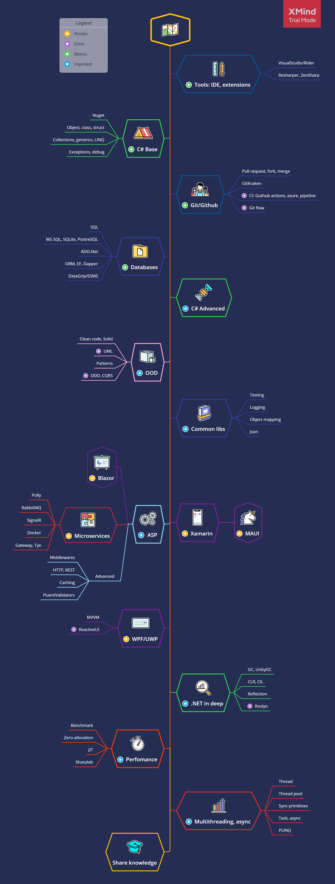

# Map

## Tools Tools, IDE, git

- Visual Studio, инфа про разные сборки и просто компоненты
  - Установка Visual Studio [link](https://docs.microsoft.com/ru-ru/visualstudio/install/install-visual-studio?view=vs-2019)
  - Гайд по VS, создание проекта [link](https://docs.microsoft.com/ru-ru/visualstudio/get-started/csharp/visual-studio-ide?view=vs-2019)
  - Немного про .Net [Метанит](https://metanit.com/sharp/tutorial/1.1.php)
- Welcome to Github
  - [Общие сведения об управлении версиями с помощью Git](https://docs.microsoft.com/ru-ru/learn/paths/intro-to-vc-git/)
  - [introduction-to-github](https://docs.microsoft.com/en-us/learn/paths/collaborate-markdown-github-pages/)
  - [Manage the lifecycle](https://docs.microsoft.com/en-us/learn/paths/manage-project-lifecycle-github/)
  - [Collaborate with others with Markdown and GitHub Pages](https://docs.microsoft.com/en-us/learn/paths/collaborate-markdown-github-pages/)
- [Git action CI](https://docs.microsoft.com/en-us/learn/paths/automate-workflow-github-actions/)

# C# base

Документация по языку от майкрософта: https://docs.microsoft.com/en-us/dotnet/csharp/programming-guide/

- [csharp-first-steps](https://docs.microsoft.com/ru-ru/learn/paths/csharp-first-steps/)
- [csharp-logic](https://docs.microsoft.com/ru-ru/learn/paths/csharp-logic/)
- [csharp-data](https://docs.microsoft.com/ru-ru/learn/paths/csharp-data/)

Немного про:
- Перечисления enum [(Метанит)](https://metanit.com/sharp/tutorial/2.12.php)
- Кортежи [(Метанит)](https://metanit.com/sharp/tutorial/2.19.php)
- Анонимные типы [(Метанит)](https://metanit.com/sharp/tutorial/3.20.php)
- Pattern matching [(Метанит)](https://metanit.com/sharp/tutorial/3.34.php)
- Nullable-типы [(Метанит)](https://metanit.com/sharp/tutorial/2.17.php)
- Строки
  - Форматирование и интерполяция строк [(Метанит)](https://metanit.com/sharp/tutorial/7.5.php) 
  - Класс StringBuilder [(Метанит)](https://metanit.com/sharp/tutorial/7.3.php) 
- Структура DateTime
  - Структура DateTime [(Метанит)](https://metanit.com/sharp/tutorial/19.1.php) 
  - Форматирование дат и времени [(Метанит)](https://metanit.com/sharp/tutorial/19.2.php) 

## Введение в ООП. Типы: классы, структуры

- Классы, Структуры, ссылочные и значимые типы
  - Классы [(Метанит)](https://metanit.com/sharp/tutorial/3.1.php)
  - Структуры [(Метанит)](https://metanit.com/sharp/tutorial/2.13.php)
  - Типы значений и ссылочные типы [(Метанит)](https://metanit.com/sharp/tutorial/2.16.php)
- Особенности типов
  - Модификаторы доступа [(Метанит)](https://metanit.com/sharp/tutorial/3.2.php)
  - Свойства и инкапсуляция [(Метанит)](https://metanit.com/sharp/tutorial/3.4.php)
  - Перегрузка методов [(Метанит)](https://metanit.com/sharp/tutorial/3.5.php)
  - Статические члены и модификатор static [(Метанит)](https://metanit.com/sharp/tutorial/3.6.php)
  - Константы и поля для чтения [(Метанит)](https://metanit.com/sharp/tutorial/3.3.php)
  - Перегрузка операторов [(Метанит)](https://metanit.com/sharp/tutorial/3.36.php)
  - Значение null [(Метанит)](https://metanit.com/sharp/tutorial/3.26.php)
  - Индексаторы [(Метанит)](https://metanit.com/sharp/tutorial/4.10.php)
- Основные механики ООП
  - Наследование [(Метанит)](https://metanit.com/sharp/tutorial/3.7.php)
  - Преобразование типов [(Метанит)](https://metanit.com/sharp/tutorial/3.11.php)
  - Перегрузка операций преобразования типов [(Метанит)](https://metanit.com/sharp/tutorial/3.37.php)
  - Виртуальные методы и свойства [(Метанит)](https://metanit.com/sharp/tutorial/3.19.php)
  - Сокрытие [(Метанит)](https://metanit.com/sharp/tutorial/3.41.php)
  - Абстрактные классы и члены классов [(Метанит)](https://metanit.com/sharp/tutorial/3.8.php)
- Класс System.Object и его методы [(Метанит)](https://metanit.com/sharp/tutorial/3.10.php)
- Интерфейсы [(Метанит)](https://metanit.com/sharp/tutorial/3.9.php)

## Коллекции, обобщения, LINQ

- Обобщения
  - Обобщения [(Метанит)](https://metanit.com/sharp/tutorial/3.12.php)
  - Ограничения обобщений [(Метанит)](https://metanit.com/sharp/tutorial/3.38.php)
- Коллекции
  - Введение в коллекции [(Метанит)](https://metanit.com/sharp/tutorial/4.1.php)
  - Обобщенные коллекции [(Метанит)](https://metanit.com/sharp/tutorial/4.4.php)
  - Список List<T> [(Метанит)](https://metanit.com/sharp/tutorial/4.5.php)
  - Коллекция Dictionary<T, V> [(Метанит)](https://metanit.com/sharp/tutorial/4.9.php)
  - Интерфейсы IEnumerable и IEnumerator [(Метанит)](https://metanit.com/sharp/tutorial/4.11.php)
- Делегаты, лямбды
  - Делегаты [(Метанит)](https://metanit.com/sharp/tutorial/3.13.php)
  - События [(Метанит)](https://metanit.com/sharp/tutorial/3.14.php)
  - Анонимные методы [(Метанит)](https://metanit.com/sharp/tutorial/3.15.php)
  - Лямбды [(Метанит)](https://metanit.com/sharp/tutorial/3.16.php)
  - Делегаты Action, Predicate и Func [(Метанит)](https://metanit.com/sharp/tutorial/3.33.php)
- Методы расширения [(Метанит)](https://metanit.com/sharp/tutorial/3.18.php)
- LINQ
  - LINQ [(Метанит)](https://metanit.com/sharp/tutorial/15.1.php)
  - Фильтрация выборки и проекция [(Метанит)](https://metanit.com/sharp/tutorial/15.2.php)
  - Сортировка [(Метанит)](https://metanit.com/sharp/tutorial/15.3.php)
  - Работа с множествами [(Метанит)](https://metanit.com/sharp/tutorial/15.4.php)
  - Агрегатные операции [(Метанит)](https://metanit.com/sharp/tutorial/15.5.php)
  - Методы Skip и Take [(Метанит)](https://metanit.com/sharp/tutorial/15.11.php)
  - Группировка [(Метанит)](https://metanit.com/sharp/tutorial/15.6.php)
  - Методы All и Any [(Метанит)](https://metanit.com/sharp/tutorial/15.10.php)
  - Отложенное и немедленное выполнение LINQ [(Метанит)](https://metanit.com/sharp/tutorial/15.8.php)
  - Делегаты и анонимные методы в запросах LINQ [(Метанит)](https://metanit.com/sharp/tutorial/15.9.php)

## Exception, работа с исключениями (id-2.1)

- [Обработка исключений](https://metanit.com/sharp/tutorial/2.14.php)
- [Блок catch и фильтры исключений](https://metanit.com/sharp/tutorial/2.28.php)
- [Типы исключений. Класс Exception](https://metanit.com/sharp/tutorial/2.29.php)
- [Создание классов исключений](https://metanit.com/sharp/tutorial/3.17.php)
- [Поиск блока catch при обработке исключений](https://metanit.com/sharp/tutorial/2.30.php)
- [Генерация исключения и оператор throw](https://metanit.com/sharp/tutorial/2.31.php)

# C# advanced

## OOD
- [Паттерны от рефакторинг Гуру](https://refactoring.guru/ru)
- [How to create better code using Domain-Driven Design](https://altkomsoftware.pl/en/blog/create-better-code-using-domain-driven-design/)
- [Active Record](https://habr.com/ru/company/domclick/blog/515560/)
- [DDD, Hexagonal, Onion, Clean, CQRS](https://herbertograca.com/2017/11/16/explicit-architecture-01-ddd-hexagonal-onion-clean-cqrs-how-i-put-it-all-together/)
- [CQRS + Event Sourcing](https://danielwhittaker.me/2020/02/20/cqrs-step-step-guide-flow-typical-application/)
- [Using strongly-typed entity IDs to avoid primitive obsession](https://andrewlock.net/using-strongly-typed-entity-ids-to-avoid-primitive-obsession-part-1/)

# Frameworks

## ASP Web API
- [Create a web API with ASP.NET Core](https://docs.microsoft.com/en-us/learn/modules/build-web-api-net-core/)
- [Build RESTFUL API witn ASP.NET Core](https://medium.com/free-code-camp/an-awesome-guide-on-how-to-build-restful-apis-with-asp-net-core-87b818123e28)
- [DI](https://docs.microsoft.com/en-us/aspnet/core/fundamentals/dependency-injection)
- [Swagger](https://docs.microsoft.com/en-us/learn/modules/improve-api-developer-experience-with-swagger/)
- [Logging](https://docs.microsoft.com/en-us/learn/modules/aspnet-logging/)
- [EF](https://docs.microsoft.com/en-us/learn/modules/persist-data-ef-core/)
- [Identity framework](https://docs.microsoft.com/en-us/learn/modules/secure-aspnet-core-identity/)
- [Design Patterns: Asp.Net Core Web API, services, and repositories](https://www.forevolve.com/en/articles/2017/08/11/design-patterns-web-api-service-and-repository-part-1/)
- [Five RESTFul Web Design Patterns Implemented](https://blog.jeremylikness.com/series/five-restful-web-design-patterns-implemented-in-asp.net-core-2.0)

## Blazor - Web UI
- [Blazzor](https://docs.microsoft.com/en-us/learn/modules/build-blazor-webassembly-visual-studio-code/)

## Microservices
- [Как работают микросервисы в контейнерах](https://dou.ua/lenta/articles/microservices-net-core/)

## WPF
- [WPF](https://docs.microsoft.com/en-us/learn/modules/create-ui-for-windows-10-apps/)
- [Reactive MVVM Pattern On The .NET Platform](https://worldbeater.medium.com/reactive-mvvm-for-net-platform-175dc69cfc82)

## .NET in deep
