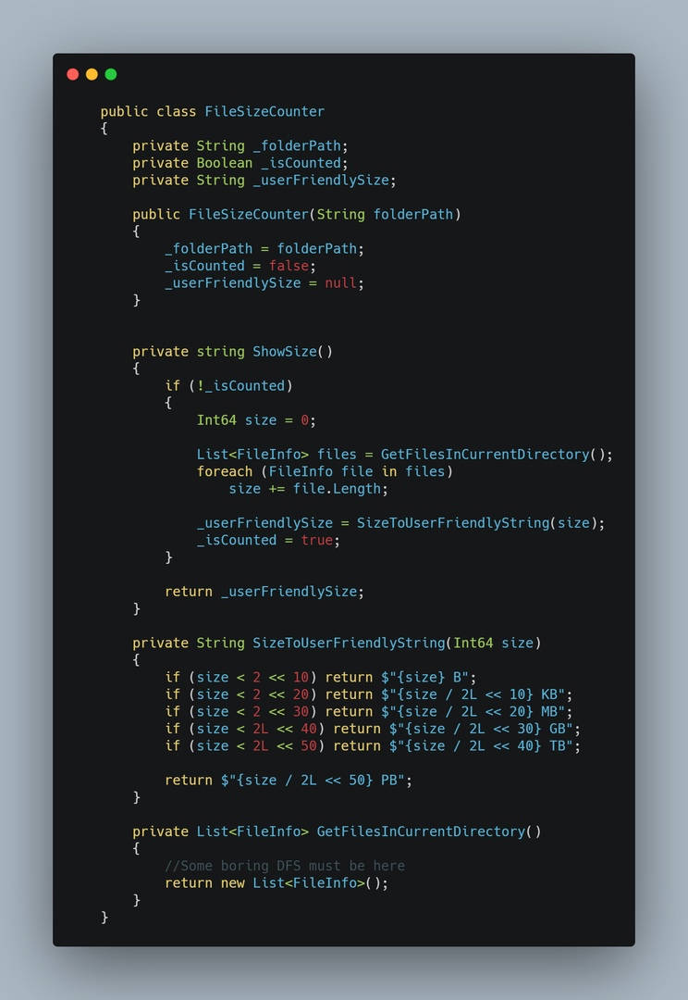
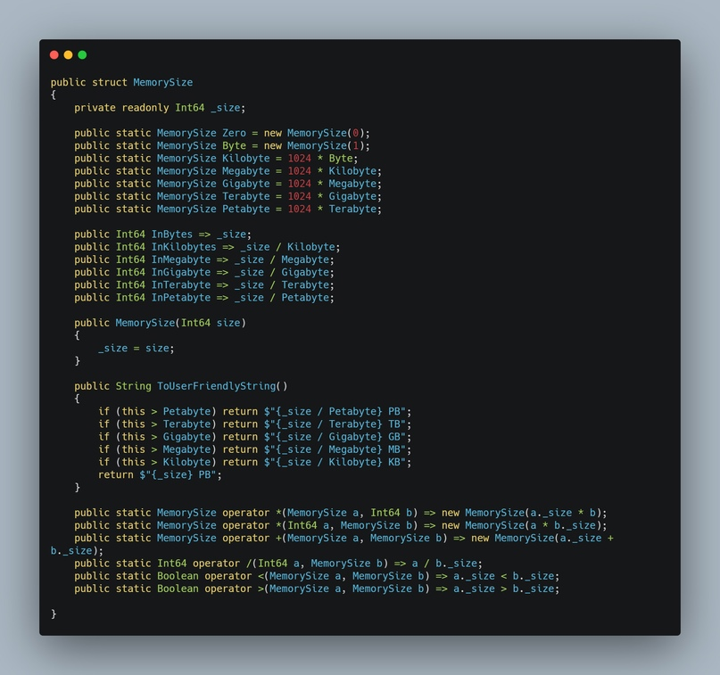
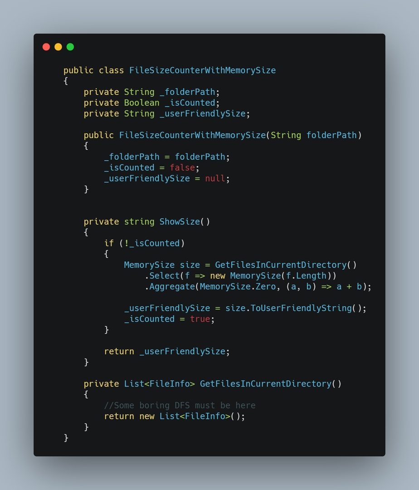

# Type design

## Тип - как способ вводить абстракции

> TODO: I2

- Абстракции != интерфейсы
- Текучие абстракции (IsPhysicalRepository)

## Код, выдерживающий проверку компилятором

- Компайл тайм валидация

Если вы уже ознакомились с ООП, то знаете общие подходы. Но так уж сложилось, что они у большинства разработчиков ООП связано с наследованием, полиморфизмом, инкапсуляцией. Другими словами - с правилами как использовать разработанный концепт. Но абсолютно никто не говорит о том, как это правильно описывать, как выделять те классы, которые потом будут наследоваться. На такие вопросы можно найти ответы в этой книге. Если попытаться ее описать кратко - она про то, как научиться правильно описывать то с чем вы работаете на формальном языке.

Человека далекого от программирования и человека, который начал хоть немного что-то изучать, разделяет умение вбивать код с IDE. Именно вбивать, неплохая формулировка, как мне кажется. Я открываю новый язык, начинаю гуглить как сделать что-то, копирую, запускаю. Это все откладывается и через какое-то время наступает новый этап - осознанное написание кода. 
Но есть небольшая проблема - мы все еще "вбиваем" код. МЫ продолжаем формулировать себе задачи в стиле "Написать код, который...". И вот тут появляются проблемы.

### DateTime. Local and UTC time

Работа со временем не такая очевидная, как может показаться. Можно выделить два типа времени - локальное и UTC (упустим момент, когда оно Undefined, это значит, что уже проиграли). Пока нас не волнует время совсем, мы можем использовать везде локальное время. Но если нужно реализовать веб сервис (например, мессенджер), то даты в базе храниться должны в едином виде, иначе не ясно как их интерпретировать. В таких случаях обычно используется UTC время, чтобы быть независимым от пользователя и локации. Но у нас остаётся возможность прочитать UTC и перевести его под часовой пояс пользователя.

При этом использование UTC времени в логике приложения может вводить в заблуждение. Например, если пользователь туду листа запросит у приложения задачи за сегодня в час ночи, когда по UTC времени ещё меньше полуночи, то ответ будет не таким, как ожидает пользователь. Также весь UI должен быть юзерфрендли и не должен содержать UTC время, которое вводит в заблуждение пользователя.

Проблемным моментом является определение типа времени. Не смотря на то, что DateTime даже есть поле с указанием типа, оно может не быть инициализировано, если мы читает информацию с базы или консоли. Сложно определиться является ли время UTC читая код. Из-за этого часто может происходить проблема, когда прочитали время, решили что оно UTC и добавили сдвиг до локального, хотя оно изначально было локальным. Такую проблему с библиотеке NodaTime решили вводом отдельных типов для Local- и ZonedDateTime

### MemorySize

Чтобы понять проблемы, рассмотрим довольно простую задачу: нужно описать логику работы с размером файлов в коде. Какие есть возможные решения? Скорее всего, вы не задумываясь уже были готовы написать int fileSize и хранить размер в байтах. Если задумались - то написали бы Int64 fileSize. Почему так? Очевидно, потому что размер - это целочисленное значение, а в Int32/Int64 к тому же определены все операторы (+ и -). Но давайте попытаемся решить первую проблему: взаимодействие с UI. Пользователи будут взаимодействовать с вашим продуктом именно через него, и если у вас имеется функционал ввода размеров файлов и вы не хотите, чтобы пользователи возненавидели вас - в UI появится возможность работать с мегабайтами или гигабайтами. В части вашего UI появится новый int fileSize, который уже хранит мегабайты. И все бы хорошо, ведь мы можем умножить на 1024^2 и получить размер в байтах. Можем, но не забудем ли? Можно бесконечно долго убеждать себя в том, что разработчики не будут ошибаться, надеяться, что они будут держать все нюансы в голове, но если в вашем проекте есть хотя бы один коммит с префиксом "fix:" - кажется, ошибиться таки можно. Как только вы реализуете в какой-то части продукта логику работы с размером - вы о ней забудете. Когда вам следующий раз нужно будет с этим работать - есть вероятность, что вы просто увидите в IntelliSense "fileSize" и скажите себе "О, то что нужно, currentSize + fileSize". В лучшем случае - вы просто потратите какое-то время на то, чтобы найти где этот размер выставляется, чтобы понять размерность.

### Решим проблему (очень просто)

И так, мы пришли к проблеме - из кода сложно понять, что именно значит int fileSize. Довольно простым решением такой проблемы является использование постфиксов.
Хранишь размер в мегабайтах? - fileSizeMb.
В Гигабайтах? fileSizeGb.
Сделал в UI выбор размера и единицы измерения? Жалко тебя. Именно в этот момент должно появится желание завести структуру из int и enum.
На самом деле, проблема следует из постановки и решения, которое было изначально выбрано. Не был учтен тот факт, что типа int не достаточно для хранения размера. Не в плане границ значений, а как типа. Тип int - это примитив, который почти не имеет логики, но мы активно пытаемся ее на него натянуть. Через время появятся пачка конверторов, конверторов которые от енамов зависят, методы, которые для пользователей форматируют строку размера определенным образом. И все это, в лучшем случае будет одним большим статическим классом, которые как-то работает с int.

### Но если есть логика вокруг сущности - возможно стоит ввести свой тип?

Описание отдельного типа позволяет определять логику работы с этим типом. Например, инкапсулировать логику создания. У типа будет возможность создаваться ссылаясь на два параметра - размер и единица измерения. Это позволит нам не забыть про конвертирование. У типа будет определен оператор + и - с этим же типом - ведь мы действительно можем сложить размеры двух файлов. Но операция MemorySize + int смысла не имеет. У типа можно определить набор нужных методов, таких как форматирование для пользовательского интерфейса.

Что мы в итоге получили от описания нового типа:
- Семантика кода - вместо int используется тип, по которому можно понять предназначение, за какую логику отвечает
- Типобезопасность - использование своего типа означает, что мы уже не можем так легко проворачивать операции сложения и умножения с любыми другими числовыми типами и это правильно с точки зрения логики. Для типа мы можем определить ограниченный набор операций и на уровне компилятора будет гарантироваться корректность выражений
- Инкапсуляция преобразований - поместив все в свой тип, можно гарантировано хранить размер в байтах и определить методы получения значения в определенных единицах. Таким образом, в UI будет читаться из MemorySize в нужном формате, а вся остальная логика работает не зная о каких-либо преобразованиях.
- Уменьшение вероятности дублирования - имея свой тип мы можем смело набивать его различными методами по работе с ним. Без него же мы бы писали в случайных местах статические приватные методы, которые было бы очень сложно отслеживать, и гарантировать, что такую же логику не сделали до вас - довольно сложно.

### Итог

У вас есть логика работы с путями? Не насилуйте string, сделайте FilePath и все нужные методы работы с путями. Сложная логика фильтрации списка каких-то данных? Не пишите статических методов, разбросанных по всему проекту — напишите класс-холдер, который будет хранить контекст и иметь методы применения фильтрации.
Для решение вашей задачи подходит примитивный тип? Класно, но может стоит задуматься о том, чтобы сделать код более читаемым?

## Проектирование типов, Категории типов

> TODO: I2

- Стабильность типа - Примитивы\Value types\Объекты со стабильными интерфейсами\боль

- Примитивы
- Сущности
- Value Object
- Service\Helper\etc.

## Value objects

Значенме можно считать Value object, если:

- Оно измеряет, оценивает или описывает объект предметной области
- Его можно считать неизменяемым
- Оно поделирует нечто концептуально целосностное, объединяет связанные атрибуты
- Его можно сравнить с другими объектами значений
- Методы связанные с VO должны быть без побочных эффектов

Обычно, когда говорят про проектирование типов - подразумевают какие-то сложные классы и их связи. Но не часто говорят про то, как можно упростить код за счет типизированных оберток. Например, в шарпе пришли к тому, что время хранить int milliseconds - не хорошо и обернули в TimeSpan. По аналогии можно в ввести структуру MemorySize вместо того, чтобы в коде хранить информацию о размерах файлов в int'ах. Оказывается, что это сильно улучшает объектную модель, делает сигнатуры понятнее, на уровне компилятора защищает от лишнего деления на 1024 при конвертации в мегабайты

## Сущности

- Идентификатор - как ключевой элемент сущностей. Неизменяемость идентификатора
  - Идентификаторы задаваемые пользователем
  - Идентификатор генерируемый приложением
  - Идентификатор генерируемый хранилищем данных
  - Идентификатор из другого контекста
- Характеристика изменчивости

Привычные практики, показал примеры, когда id - это инт и когда guid, плюсы минусы. Рассказать как генерировать это id, показать на примере баз данных, как ответственность по генерации можно отдавать вне программы.

Что объект после создания всегда должен находится в "правильном" состоянии, что не должно быть ситуации, когда все поля публичные и их может пользователь неправильно назначить или наоборот не инициализировать.Стабильность типа. Иммутабельность типов уменьшает вероятность проблем с типом. Например, та же структура MemorySize будет отлично работать если у нее не будет сеттеров (а просто одно int поле внутри храниться) и они будет пересоздаваться. И наоборот, если у класса много изменяемых полей, то нужно в каждый момент времени быть уверенным, что изменение не сломает что-то.

Конструтирорвание типа, проверка корректности атрибутов и свойств - валидация. Про валидацию очень хорошо написано в книге [D2] (глава 5, сущности. Выявление сущностей. Проверка корректности)

## Stateful, stateless

> TODO: I2

## Mutable, immutable

> TODO: I2

## Анемичная модель предметной области [S1]

1. Структуры данных и операции над ними (поведение) разделены. Чаще всего структуры данных называют «сущностями», а поведение — «сервисами».
2. Структура программного код отражает скорее паттерны и фреймворки.
3. Бизнес-правила либо невозможно понять, путем изучения кода, либо это дается с большим трудом.
4. И наконец, инварианты не соблюдаются, а зачастую даже отрицается такая необходимость или возможность

Примеры: типичные реализации с применением Repository + Services. Например, вот по этой статье можено легко собрать систему с анемической моделью - [https://www.forevolve.com/en/articles/2017/08/11/design-patterns-web-api-service-and-repository-part-1/](https://www.forevolve.com/en/articles/2017/08/11/design-patterns-web-api-service-and-repository-part-1/)

## Насыщенная модель предметной области [A2]

1. Структура данных и поведение совмещены в одних и тех же классах.
2. Структура программного кода отражает структуру домена, т.е. классы, относящиеся к бизнес-логике должны называться «касса», «проводка», «платежная ведомость», а не «сервис», «репозиторий» или «прокси».
3. Самое важное, соблюдаются инварианты объектов, т.е. их состояние непротиворечиво.

Примеры в статье [A2] и [D1]. В D1 хорошое сравнение и примеры перехода из одной модели в другую. Также хорошо описано про проектирование сущностей в [D2] (глава 5. Сущности. Выявление сущностей и свойств)

## Sources

- [S1] - [http://samolisov.blogspot.com/2012/10/anemic-domain-model.html](http://samolisov.blogspot.com/2012/10/anemic-domain-model.html)
- [F1] - [https://martinfowler.com/eaaCatalog/index.html](https://martinfowler.com/eaaCatalog/index.html)
- [A1] - [https://habr.com/ru/post/259829/](https://habr.com/ru/post/259829/)
- [A2] - [https://habr.com/ru/company/jugru/blog/503868/](https://habr.com/ru/company/jugru/blog/503868/) (там оч классный доклад в открытом доступе + преза к нему - [https://drive.google.com/file/d/1ZvDGlXCNL3JIFi2LaYiYye-d03AefyeV/view](https://drive.google.com/file/d/1ZvDGlXCNL3JIFi2LaYiYye-d03AefyeV/view))
- [D1] - [https://altkomsoftware.pl/en/blog/create-better-code-using-domain-driven-design/](https://altkomsoftware.pl/en/blog/create-better-code-using-domain-driven-design/)
- [D2] - Реализация методов предметно-ориентированого проектирования, Вон Вернон
- https://nodatime.org/2.4.x/api/NodaTime.LocalDateTime.html