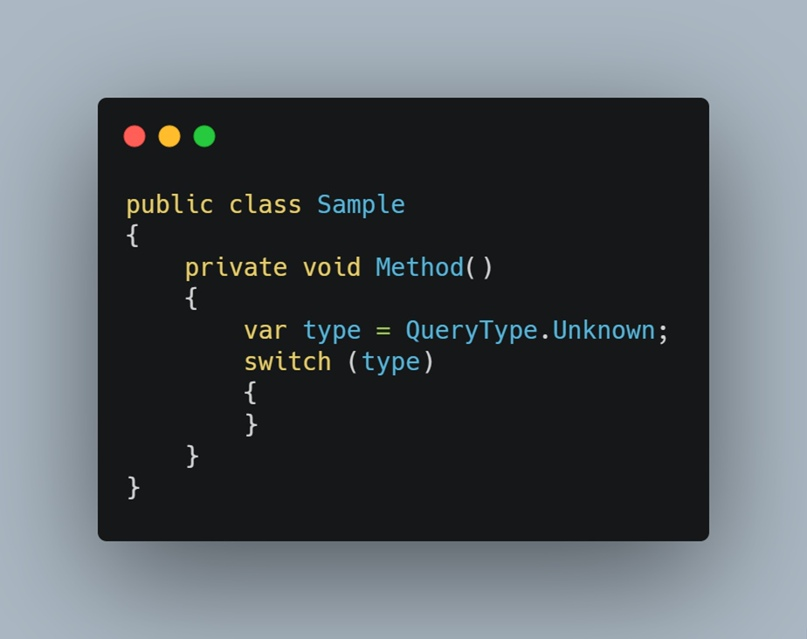
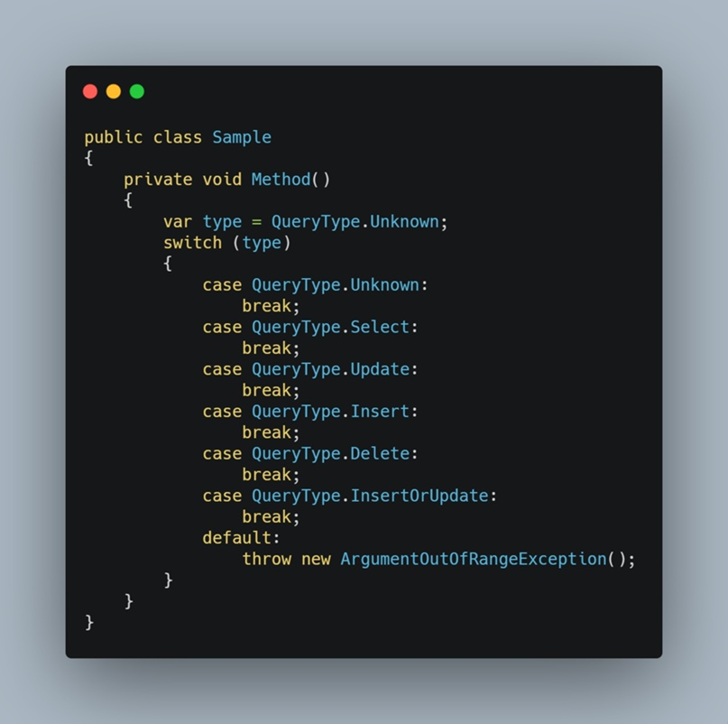

# Делай меньше, делай больше

Когда я год назад смотрел на своего лида - у меня постоянно появлялся вопрос: "А почему он не делает вот так?". Это касалось разных вещей, в том числе ведения некого current state'а по текущим задачам _регулярно_. Я охотно каждый день его обновлял и удивлялся почему так не делаю другие. Но шло время, сначала количество задач на мне стали превышать мою скорость их закрытия, обновлять стейт по каждой было все сложнее. А если смотреть на сегодняшний день - их количество увеличилось где-то в 8 раз. Стало понятно, что тайм менеджмент либо спасёт, либо погубит.

Постараюсь рассказать как не умереть от таких изменений в жизни (или хотя бы протянуть чуть больше), при этом не доводя это все до советов "Спи эффективнее!". И перед тем как пытаться оптимизировать что-то, стоит задать себе вопрос: "А зачем это делать?". С жизнью все просто: быстрее сделал лабы - больше времени на себя. С работой чуть менее очевидно. Казалось бы - нужно отработать 8 часов, что изменится от того, что я чуть более эффективно поработаю если все равно потом возьму следующую задачу? Ответ на этот вопрос есть смысл задать еще раз, ближе к концу.

Небольшой план, чтобы можно было перепрыгнуть к интересующему:

1. TODO
2. Код (на примере C#)
3. Teamwork

## Todo

А для начала решим что же делать, если время уже закончилось, хотя работаю я все еще на 120%. Во-первых, начать осознавать ситуацию, объем проблемы. В этом помогает TODO-лист. Это довольно стандартный совет, но нужно понимать зачем этом лист нужен, вы же тратите время на его ведение - значит ожидаете что-то получить? Туду решает две проблемы: память и метрики. Я, как человек с напрочь отбитой памятью, не могу в себе хранить задачи на более чем день - постоянно что-то забывается, а потом вспоминаю через 4 месяца, что хотел человеку написать. Но важнее тут именно метрики. Количество задач - неплохой показатель загруженности. Если вы замечаете, что на сегодня у вас две задачи висит, а на завтра шесть - можно задуматься о том, что будет неприятно, если какую-то задачу не попробовать решить сегодня. Также, это поможет ответить на вопрос "А ты как, не занят?". Задачи могут быть по объему довольно разные, научить и приучить себя их декомпозировать - это тоже неплохой шаг к более эффективному учету задач. Но нужно не перестараться - записывая все своих хотелки есть вероятность наспамить кучу задач, которые не будут выполнены (вообще или хотя бы в течении полугода). Они будут путать вас с оценкой загруженности и демотевировать - такое лучше скидывать в отдельную помойку "Если бы в сутках было 30 часов".

Ещё одна причина вести учет своих задач - синхронизация с другими людьми. Задачи иногда подразумевают коммуникацию, кооп или зависимость других людей/задач. В такой ситуации неизбежны "Ну как там? Когда готово будет? А что уже сделал? А ты можешь посмотреть это завтра?". Большая часть таких вопросов сразу отпадут, если у человека есть доступ к вашему списку задач. Один убранный такой вопрос - экономия времени двух человек. Я, к примеру, не представляю сколько бы лишнего времени я постоянно убивал, если бы не имел возможности отслеживать активность своих тимейтов которым я делегирую задачи. Поэтому, при работе в команде, даже если людей мало а "проект" на десяток задач максимум - договоритесь о способе контроля задач. Как бонус, вы получите лишний повод документировать свои действия и расписывать подробности реализации. Разумеется, есть черта после которой учет превращается в необоснованную трату времени, с этим тоже нужно быть осторожным.

На скриншоте - Mircosoft To Do, очень удобный инструмент для задач с синхронизацией и с мобильными клиентами.

## Код

Дисклеймер: содержит много рекламы языка C# и инструментов для работы с ним.

Туду вещь все же вариативная, абстрактная, попробуем посмотреть на более приближенные примеры - как код писать и как его читать. Начнем со второго. Сразу проговорю банальную фразу - "код редко пишут и часто читают". Возможно, это не так очевидно, когда дело касается университетских лабораторных, которые сделались за ночь. Но как только руки доходят до больших проектов - становится понятно, что большую часть времени будет занимать чтение и это нормально. Во время такого перехода ранее тривиальные задачи обретают совершенно иной объем сложностей. Казалось бы, что мешает взять и пройтись по папкам, чтобы найти где лежит какой-то класс? Наверное то, что в проекте файлов резко стало несколько сотен, папки исчисляются десятками, а желание смотреть после 6-ого файла уже нет. Именно в такой ситуации нужно вспомнить про инструменты для разработки. Если конкретно про описанный слушая, то решения будут сводиться к поисковым тулзам. Для C#'а есть прекрасная вещь Resharper, хотя и сама Visual Studio умеет делать приятно. Три фичи без которых я бы не смог читать код:

Поиск текста. Решарпер умеет делать как полнотекстовый поиск по всей кодовой базе, так и "умный поиск" по названиям классов.
Поиск использований и value origin. Это функционал который я хотел сделать руками, когда впервые попал на большой проект (тогда еще не знал, что решарпер умеет это делать так хорошо) - построение дерева вызовов метода. Т.е. тыкнув один хоткей на метода можно сразу посмотреть все места где метод вообще используется, а не ходить и искать. Как бонус - древовидность, можно посмотреть где используется метод который использует интересующий метод и так дойти до самого старта программы.
Построение дерева наследования и реализаций. Т.е. для типа (или его метода) можно в один хоткей посмотреть наследников (или реализацию в случае метода).
Важным аспектом также является нейминг. Я встречал людей, которые горели на придирки к названиям и это вызывало у меня вопросы. Давая название классу вы можете как объяснить читателю причину существования класса и название, так и ввести в заблуждение и создать ложное чувство понимания происходящего. Это одна из причин почему следует таки уделить внимания изучению паттернов (понимать что значат слова "Билдер" и "Адаптер") и всяким абстрактным вещам как Domain Design (научиться разделять логику на сущности так, чтобы их понимали другие). Немного апнув свои навыки чтения можно хорошо так сэкономить время на его чтение - понимать суть классов не рассматривая его детали.

Но что же про написание кода? Тут все просто эффективность можно измерить объемом кода, который за вас пишут ваши инструменты. Мой любимый пример - это работа с enum'ами. Имея код

Можно одним движением сгенерировать подготовленный оператор switch, который будет содержать все параметры enum'а:

И это просто спасение. Каждый раз, когда вы делаете какое-то шаблонное действие, стоит задуматься "а могут ли инструменты сделать это за меня?". Ведь таких микромоментов очень много и они все выстраиваются в одну большую оптимизацию. Набросаю небольшой список того, что советую попробовать открыв C#-проект (можете прямо сейчас в своем todo-листе завести задач!):

Ренейм. Решарпер умеет это делать очень хорошо! Он предложит переименовать связанные классы, если они содержат подстроку, или переменные этого типа, если у нее совпадает имя хоть ка-кто
Автоимплементация интерфейсов. Если класс должен реализовать интерфейс, то ваш код прекрасно знает какие методы должны там быть и может сам сгенерировать их сигнатуру
Инверсия условий. Я думаю не мне одному приходилось иногда менять местами текст в if и else по разным причинам. Это довольно простое действие, которое за вас тоже могут сделать инструменты!
Кажется, метод стал слишком большим? Не беда, решарпер может за вам вынести его кусок в другой метод! (или наоборот заинлайнить)
Перемещение порядка аргументов в метода, удаление не используемых в вызывающем код - это все тоже не стоит делать руками.
ctor, ctorp, prop - это мастхев шаблоны, которые пишут код.
А если вы познали дзен - нельзя останавливаться! Ведь есть много расширений, освоив которые можно писать код быстрее, приятнее и не отвлекаясь на ерунду:

Если автокомплита не хватет - есть лайфтемплейты, например ZenSharp. Это расширение для решарпера, которое превратит объявление любого поля класса в написание 3-4 символов (https://github.com/ulex/ZenSharp)
Если вам повезло меньше и вы не пишете на C# - для вас все равно найдется что-то полезное! Например, если у вас постоянно дергается глаз от упоротых SQL-скриптов, а писать как-то нужно - есть форматеры, которые за вас будут проблемы отступов и всего такого (https://www.apexsql.com/sql-tools-refactor.aspx)
Но работа с кодом не ограничивается написанием его. Приходится работать с системами контроля версий, которые тоже отнимают время. Например, наслушавшись других разработчиков можно поставить себе консоль и пытаться через нее работать с гитхабом убивая весь UX и усложняя даже простые вещи. Да, люди, которые много лет работали так - привыкли, даже могу поверить, что у них первоманс больше, но если за плечами нет такого опыта, а работа с гитом может еще вызывать трудности - перекладывайте их на GUI для GIT'а. Например, GitKraken. За довольно короткое время использования можно найти те пару кнопок, которые нужно наживать и все уже будет казаться более прозрачным. Написание команд будет сводиться к тыканию на нужные кнопки, а просмотр истории - на скролинг в GUI. Например, с помощью GitKaraken можно создать репозитория сразу на гитхабе, закомитить и запушить туда свои изменения. Или удобно создать и отправить пул-реквест в чей-то репозиторий - это все находится в одном месте и имеет интуитивный интерфейс.

Не забывайте про существования библиотек. Помните, что скорее всего вашу задачу (или ее подтаску) уже кто-то пытался решить. Если вы задумываетесь о написании собственного парсера HTML - остановитесь, подумайте еще раз хотите ли вы этого или же вам достаточно просто взять готовую библиотеку и написать 10 строчек для решения проблемы?

## Тимворк

Работа в команде - это всегда издержки. Работая один человек не тратит время на синхронизацию или объяснения своих задач/результатов. Но с другой стороны - один человек всегда ограничен временем, которое у него есть на проект. И в какой-то момент становится понятно, что издержки оправданы. Вопрос в том, насколько много придется за это платить. Отличный тому пример - вопросы. Есть две крайности этой проблемы. С одной стороны есть люди, у которых есть цель - узнать ответ на свой вопрос и остальное их не сильно касается. Такое можно наблюдать в больших телеграм чатах о ЯП - "У меня не работает код, что делать?". Такой вопрос не несет много информации и читателю нужно будет потратить достаточно много времени, чтобы вникнуть. А потом еще может оказаться, что ответ - это первая ссылка в гугле. Схожая ситуация - это вопросы "А кто-то работал с _технология-нейм_?". Эта ситуация хорошо описана тут: https://nometa.xyz/. Другая крайность - это типичные джуны, которые сидят с проблемой и боятся ее задать т.к. наоборот ставят время других людей свыше своей проблемы. Стоит отдавать отчет, что проблема таким образом не решается, а в какой-то момент ее все равно нужно будет переложить на плечи более опытного коллеги.

Еще один кейс - это ситуации когда нужно наоборот информацию донести. Рассказать кому-то о своих успехах/проекте. И в зависимости от обстоятельств и размера аудитории до которой нужно донести, есть ряд решений. Поделиться с другом своей идеей - наверное, проще созвоном в дискорде. Обсудить план действий группе людей - возможно, стоит составить текстовый док и зашарить. Хочется донести свои знания и свой проект в массы? Выберите оптимальные способы, возможно даже раскошельтесь и потратьте время на составление диаграмм (о шок, оказывается людям картинки смотреть проще чем читать!). Не правильно выбрав стратегию однажды я обрек себя на пересказ шаблонной информации десятку людей. Хотел сэкономить ведь так лень писать полобные лонгриды - убил еще больше времени. Но и не стоит забывать о времени собеседника. Выплеснув кучу воды, забивая поток информации чем-то слабосвязанным с темой можно потратить кучу его времени (а потом он сделает также по отношению к вам!).

Подводя итог - думайте о том, как поймет вас ваш собеседник, что ему нужно будет сделать чтобы ответить на ваш вопрос. Стоит ли потратить еще какое-то время на подготовку дополнительно информации по проблеме или он и так все знает и быстрее ответит чем вы что-то сделаете.

Если вы вдохновитесь и захотите порисовать - советую посмотреть на StarUML, удобная программа для построения графиков. А если нужно организовать задачи между командой - посмотрите в сторону To do который умеет шарить списки задач между аккаунтами или GitKraken Glo - доска (как трелло, да) для менеджмента задач которая встроенная в GitKraken и имеет очень неплохую интеграцию.

## Итог

Я постарался скипнуть все темы связанные с прокрастинацией и прочим. Нужно понимать, что невозможно работать 100% времени. Часть времени все равно будет уходить на общение с коллегами, просмотр мемов про дженерики в Го или холиваром "нужно ли использовать LINQ". Но даже без этого - минимизировав время на написание бойлер кода, на повторное объяснение тестировщику что ты сделал вчера (потому что не написал доку), или попытки вспомнить чем занимался вчера чтобы ответить лиду - в рабочем графике можно выкроить дополнительно время на более интеллектуальные задачи, которые помогут развиваться. Или получить дозу позитивных эмоций за счет похвалы от лида за своевременность выполнения.

Делай меньше рутины, чтобы успевать делать больше импакта! И не забывайте, что время - это тоже ресурс, который нужно уметь пользоваться.