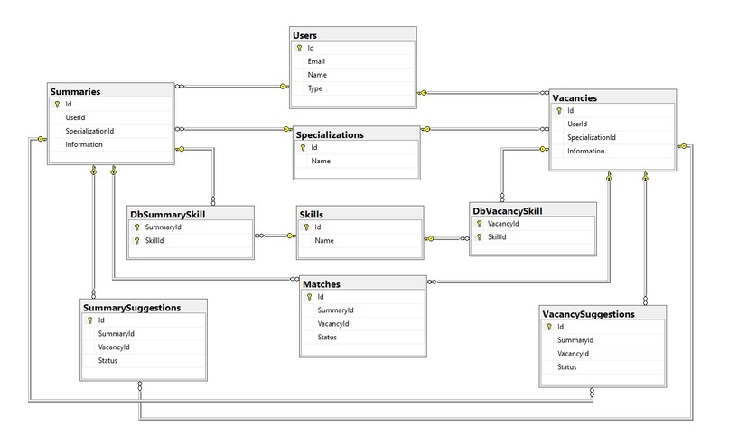

# А что писать?

## Предисловие

Практически у каждого, кто начинает изучать язык программирования, рано или поздно возникает вопрос: а что, собственно, делать со знаниями этого языка? Самый простой и наиболее популярный ответ – применить на практике свои знания и написать пет проект.

Мне понадобилось более семи месяцев, чтобы наконец ответить себе на этот вопрос и начать писать что-то больше лабораторной работы или скрипта из десяти строк. Случилось это всё благодаря попаданию в Veeam Academy, где личный проект – обязательная часть курса, и хочешь не хочешь, но придётся его писать.

Дальнейшей историей успеха разработки я постараюсь выделить основные этапы создания своего проекта и обратить внимание на главные ошибки и способы их избежать.

## Идея

Для начала нужно определиться с концепцией того, что будет разрабатываться. Здесь мы и встречаемся с первой и довольно большой ошибкой: в голову приходит гениальная идея написать что-то необходимое всему миру, что уничтожит бедность, рак и обеспечит мир во всем мире. Но чудо не произойдёт, и скорее всего ваш первый проект - то, что просто поможет вам закрепить знания на практике, и хорошо бы, чтобы это было приложение, которое необходимо именно вам. Это поможет сохранить интерес к разработке и позволит дорабатывать ваше приложение ещё долгое время.

Я же пошел по другой дороге и решил, что круто бы было заняться проблемой поиска работы и написать приложение, которое облегчит контакт работодателей и специалистов (да, hh 2.0), а ещё и оформить это в стиле Тиндера. Грандиозная идея, и вроде бы даже есть, что писать, но по окончании академии моя дальнейшая разработка приложения ограничилась лишь парочкой правок и отправлением проекта в архив. Вот так и зародился Jinder (Job + Tinder).

Итого, урок номер один - занимайтесь догфудингом. Найдите то, что вам нужно в повседневной жизни: агрегатор скидок в стиме, фильмов на кинопоиске, бот для работы с ИСУ.

## Проектирование

Неожиданно, но иметь только идею не достаточно, нельзя просто сесть и начать писать код (вообще можно, но надолго ли вас хватит без чёткой задачи и понимания того, что нужно делать?). Для начала полезно выделить основной функционал приложения – собственно, те возможности, которые мы хотели бы получить в итоге.

В моём случае вышел небольшой список жизненно важных функций приложения:

Авторизация пользователей
Создание профиля вакансси/резюме
Подбор кандидатов согласно вакансии(и наоборот)
Механизм оценки вакансси/резюме отказ: навсегда скрыть предложение из подборки отложить: временно убирает предложение с последующим возвращением в подборку одобрение: взаимное одобрение вызовет "матч"
Матчинг и обмен контактами
Помимо это был еще список второстепенных фичей, но упоминать его не будем, так как до их реализации я так и не добрался.

Базовый функционал выделен, пришло время воплощать в жизнь желаемое, но не так быстро. Накидать все лишь бы как можно, но хочется же сделать все гибко и адаптивно, чтобы легко было найти багу или допилить новую фичу. Первостепенно стоит разделить свое приложение на слои. Так как задачей личного проекта было создать клиент-серверное приложение, очевидно что можно (и даже нужно) отделить всю логику приложения от пользовательского интерфейса. Пользователей, их резюме и вакансии нужно где-то хранить, значит выделим еще и слой работы с базой. Итого классическое трио из слоев приложения:

UI (user interface)
BLL (business logic layer)
DAL (data access layer)
Слои есть, теперь стоит углубиться в слой бизнес логики и понять с чем нам предстоит работать. Необходимо выделить модели и продумать их взаимодействие. Наиболее удобно делать это все визуализируя, тут на помощь приходит UML и крутые профессиональные редакторы для него. Но за неимением опыта и знаний и прибег к работе с app.diagrams.net. Это очень простой и не менее функциональный редактор диаграмм, где имея базовые представления о UML (я прочел 1.5 статьи из гугла) и ООП можно визуализировать свои модели. Вышло как-то так:

## Разработка

Наконец-то можно писать код, или все еще не писать. Вспомним что у нас клиент-серверное приложение, а значит клиент с сервером должен взаимодействовать посредством запросов. Тут есть выбор из сложного и довольно старого WCF и ASP.Net WEB Api. Я выбрал ASP.Net, так как у меня уже был некий опыт работы с ним.

### Самая большая ошибка

Уже на этом моменте стоит выделить главную ошибку начинающих разработчиков - стремление сделать все идеально с самого начала. Вместо часов обдумывания как все сделать максимально хорошо, можно сделать рабочий прототип и впоследствии отрефачить, доработать и получить тот самый "идеал".

### API

В ASP Api строится из контроллеров. Контроллеры должны обрабатывать запросы и обращаться к логике нашего приложения, а значит никакой логики в контроллерах, а если не там то где? Тут на помощь приходит чудо недопаттерн Controller-Service-Repository.

Всю логику мы разбиваем на единицы называемые сервисами, с ними взаимодействуют контроллеры, а вся работа с базой инкапсулирована в репозитории. Просто, элегантно, эффективно.

Вернемся к контроллерам. При получении запроса сервер должен уметь идентифицировать пользователя. Делать это будем посредством токенов передаваемых вместе с запросами. А чтобы каждый контроллер умел это понимать что за пользователь прислал я определил базовый контроллер аутентификации, от которого будут унаследованы все другие контроллеры.

Теперь в любом контролере унаследованном от этого мы будем иметь доступ к методу ValidateToken, который по токену вернет нам Id пользователя.

Когда позже я узнаю, что это не нужно было делать, ведь в ASP из коробки работает авторизация, и сделать все это можно было парочкой атрибутов.

Пример метода UserController получения информации о пользователе, который отправил запрос.

Для незнакомых с контролерами ASP разработчиков, выглядит страшно и непонятно, но самое главное что можно выделить отсюда:

метод вызывается посредством http get запросов
возвращает один из 3 статус кодов, для этого мы оборачиваем возвращаемое значение в ActionResult
для получения объекта пользователь мы обращаемся к сервису UserService

### Dependency Injection

Уже может возникнуть закономерный вопрос как нам связать контролеры и сервисы, а в последствии сервисы и репозитории? Все верно будем в конструктор контроллера передавать сервисы, аналогично с сервисами. А чтобы с этим работать в последствии было просто, воспользуемся Dependency Injection и встроенным в ASP DI контейнером. DI - мощная, полезная и простая технология, с которой безусловно стоит ознакомится.

По итогу Startup нашего ASP приложения наполнится подобными строками:

Теперь контейнер сам будет подставлять в конструкторы реализации интерфейсов.

### Тестирование

Как только начинаешь писать логику хочется быть уверенным, что все работает как задумано, здесь на помощь приходит unit тестирование. Для этого я завел отдельную сборку для тестов и воспользовался фреймворком для создания тестов NUnit.

NUnit - чудесная возможность погрузится в мир максимально читаемых ассертов с помощью класса Is:

Как же нам тестировать сервисы в отрыве от репозиториев? Добро пожаловать в мир моков и библиотеки Moq. Достаточно подсунуть в конструктор вместо объекта:

Вуаля, и у нас есть реализация интерфейса, которая при вызове Get(0) всегда возвращает нужное нам значение.

### Работа с БД

Первоначально вместо обращений в базу я сделал замоканные реализации репозиториев, внутри которых данные хранились внутри коллекций. Чтобы работать с реальной базой я решил использовать Entity Framework. Если вам не критично важна скорость обращений в базу, то это идеальный выбор. Entity Framework - ORM от Microsoft, которая позволяет описав в коде модели базы данных, легко и просто взаимодействовать с базой.

Моя работа началась со слов: "Сделаю пару табличек за вечер и база готова", а закончилась несколькими днями усердных разборок с EF, связями, миграциями и вопросами "А почему?". Благо на все можно найти ответы на MSDN и по итогу я получил такую базу:

А обращения в базу выглядели кратко и красиво (по-моему субъективному мнению):

### UI

В разработке пользовательского интерфейса приложения важно помнить, что первостепенную важность имеет функциональность этого интерфейса, а не его внешний вид. Я пренебрёг этим советом и убил кучу времени на красивую менюшку. В итоге у меня красивое меню и UI, в котором часть готовых на сервере фичей попросту не реализованы.

Весь UI сделан на WPF. Столько болей и мучений я давно не испытывал, зато познакомился с контролами, биндингами, командами и прочими прелестями WPF. А эта чудо менюшка создана с помощью ModernWPF.

А раз мы затронули пользовательский интерфейс, то стоит уделить внимание и тому, как соединить готовые фичи бэкенда с UI. На стороне сервера уже готова Web API, взаимодействовать с которой можно посредством http-запросов. Но прописывать запрос для каждого обращения к серверу это слишком долго, поэтому я воспользовался Refit.

Refit - чудесный инструмент, который позволяет все взаимодействия с сервером свести к описанию интерфейсов подобного вида:

Теперь мы можем получить экземпляр класса с помощью RestService.For<ISummaryClient>(Session.HostUrl) . При вызове нужных нам методов будут автоматически отправляться запросы на сервер, а полученные запросы будут десериализованы.

## Итог

Я не получил идеального продукта и даже приложения, которое теперь использую, но я получил самое главное - опыт. Огромный опыт разработки приложений, опыт работы с большим количеством технологий. Помимо этого я встретился с множеством проблем и большинство даже решил.

Это был мой первый опыт проектирования, и почти всё я сейчас сделал бы по-другому, но понимание этого пришло только благодаря практике. Отсюда и главный совет – пробуйте, практикуйтесь. Начиная с чего-то малого и довольно простого, вы тоже получаете навыки, которые пригодятся в последующей разработке. Не бойтесь работать с новыми для вас технологиями, разработчики уже придумали бесконечное множество полезных и эффективных инструментов для большинства ваших задач.

## Ссылки

- Jinder (https://github.com/s4xack/Jinder)
- Цикл статей о создании WEB Api проекта на ASP (https://www.forevolve.com/en/articles/2017/08/11/design-patterns-web-api-service-and-repository-part-1/)
- Dependency Injection (https://docs.microsoft.com/ru-ru/aspnet/core/fundamentals/dependency-injection?view=aspnetcore-3.1)
- Unit тестирование (https://metanit.com/sharp/aspnet5/22.1.php)
- Moq (https://github.com/Moq/moq4/wiki/Quickstart)
- Refit (https://github.com/reactiveui/refit)
- ModernWPF (https://github.com/Kinnara/ModernWpf)