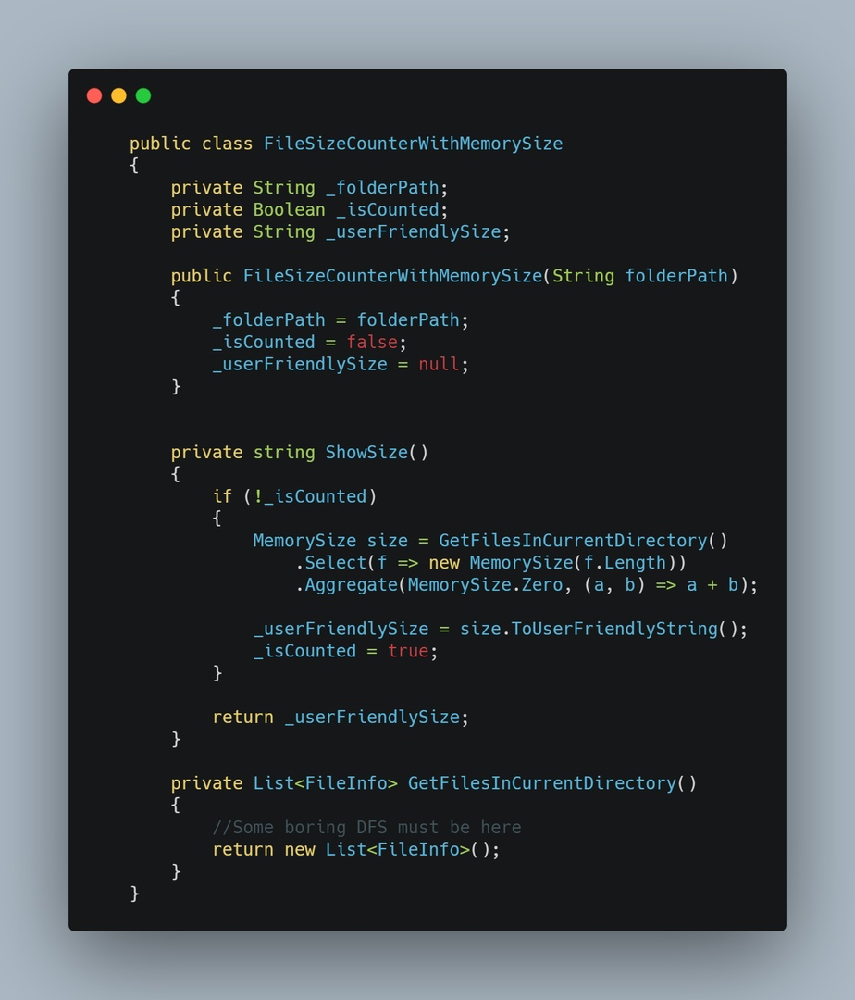

Если вы уже ознакомились с ООП, то знаете общие подходы. Но так уж сложилось, что они у большинства разработчиков ООП связано с наследованием, полиморфизмом, инкапсуляцией. Другими словами - с правилами как использовать разработанный концепт. Но абсолютно никто не говорит о том, как это правильно описывать, как выделять те классы, которые потом будут наследоваться. На такие вопросы можно найти ответы в этой книге. Если попытаться ее описать кратко - она про то, как научиться правильно описывать то с чем вы работаете на формальном языке.

Человека далекого от программирования и человека, который начал хоть немного что-то изучать, разделяет умение вбивать код с IDE. Именно вбивать, неплохая формулировка, как мне кажется. Я открываю новый язык, начинаю гуглить как сделать что-то, копирую, запускаю. Это все откладывается и через какое-то время наступает новый этап - осознанное написание кода. 
Но есть небольшая проблема - мы все еще "вбиваем" код. МЫ продолжаем формулировать себе задачи в стиле "Написать код, который...". И вот тут появляются проблемы.

## MemorySize

Чтобы понять проблемы, рассмотрим довольно простую задачу: нужно описать логику работы с размером файлов в коде. Какие есть возможные решения? Скорее всего, вы не задумываясь уже были готовы написать int fileSize и хранить размер в байтах. Если задумались - то написали бы Int64 fileSize. Почему так? Очевидно, потому что размер - это целочисленное значение, а в Int32/Int64 к тому же определены все операторы (+ и -). Но давайте попытаемся решить первую проблему: взаимодействие с UI. Пользователи будут взаимодействовать с вашим продуктом именно через него, и если у вас имеется функционал ввода размеров файлов и вы не хотите, чтобы пользователи возненавидели вас - в UI появится возможность работать с мегабайтами или гигабайтами. В части вашего UI появится новый int fileSize, который уже хранит мегабайты. И все бы хорошо, ведь мы можем умножить на 1024^2 и получить размер в байтах. Можем, но не забудем ли? Можно бесконечно долго убеждать себя в том, что разработчики не будут ошибаться, надеяться, что они будут держать все нюансы в голове, но если в вашем проекте есть хотя бы один коммит с префиксом "fix:" - кажется, ошибиться таки можно. Как только вы реализуете в какой-то части продукта логику работы с размером - вы о ней забудете. Когда вам следующий раз нужно будет с этим работать - есть вероятность, что вы просто увидите в IntelliSense "fileSize" и скажите себе "О, то что нужно, currentSize + fileSize". В лучшем случае - вы просто потратите какое-то время на то, чтобы найти где этот размер выставляется, чтобы понять размерность.

## Решим проблему (очень просто)

И так, мы пришли к проблеме - из кода сложно понять, что именно значит int fileSize. Довольно простым решением такой проблемы является использование постфиксов.
Хранишь размер в мегабайтах? - fileSizeMb.
В Гигабайтах? fileSizeGb.
Сделал в UI выбор размера и единицы измерения? Жалко тебя. Именно в этот момент должно появится желание завести структуру из int и enum.
На самом деле, проблема следует из постановки и решения, которое было изначально выбрано. Не был учтен тот факт, что типа int не достаточно для хранения размера. Не в плане границ значений, а как типа. Тип int - это примитив, который почти не имеет логики, но мы активно пытаемся ее на него натянуть. Через время появятся пачка конверторов, конверторов которые от енамов зависят, методы, которые для пользователей форматируют строку размера определенным образом. И все это, в лучшем случае будет одним большим статическим классом, которые как-то работает с int.

## Но если есть логика вокруг сущности - возможно стоит ввести свой тип?

Описание отдельного типа позволяет определять логику работы с этим типом. Например, инкапсулировать логику создания. У типа будет возможность создаваться ссылаясь на два параметра - размер и единица измерения. Это позволит нам не забыть про конвертирование. У типа будет определен оператор + и - с этим же типом - ведь мы действительно можем сложить размеры двух файлов. Но операция MemorySize + int смысла не имеет. У типа можно определить набор нужных методов, таких как форматирование для пользовательского интерфейса.

Что мы в итоге получили от описания нового типа:
- Семантика кода - вместо int используется тип, по которому можно понять предназначение, за какую логику отвечает
- Типобезопасность - использование своего типа означает, что мы уже не можем так легко проворачивать операции сложения и умножения с любыми другими числовыми типами и это правильно с точки зрения логики. Для типа мы можем определить ограниченный набор операций и на уровне компилятора будет гарантироваться корректность выражений
- Инкапсуляция преобразований - поместив все в свой тип, можно гарантировано хранить размер в байтах и определить методы получения значения в определенных единицах. Таким образом, в UI будет читаться из MemorySize в нужном формате, а вся остальная логика работает не зная о каких-либо преобразованиях.
- Уменьшение вероятности дублирования - имея свой тип мы можем смело набивать его различными методами по работе с ним. Без него же мы бы писали в случайных местах статические приватные методы, которые было бы очень сложно отслеживать, и гарантировать, что такую же логику не сделали до вас - довольно сложно.

## Итог

Цель данного повествования отображена в заголовке — make type not classes.

У вас есть логика работы с путями? Не насилуйте string, сделайте FilePath и все нужные методы работы с путями.

Сложная логика фильтрации списка каких-то данных? Не пишите статических методов, разбросанных по всему проекту — напишите класс-холдер, который будет хранить контекст и иметь методы применения фильтрации.

Для решение вашей задачи подходит примитивный тип? Классно, но может стоит задуматься о том, чтобы сделать код более читаемым?