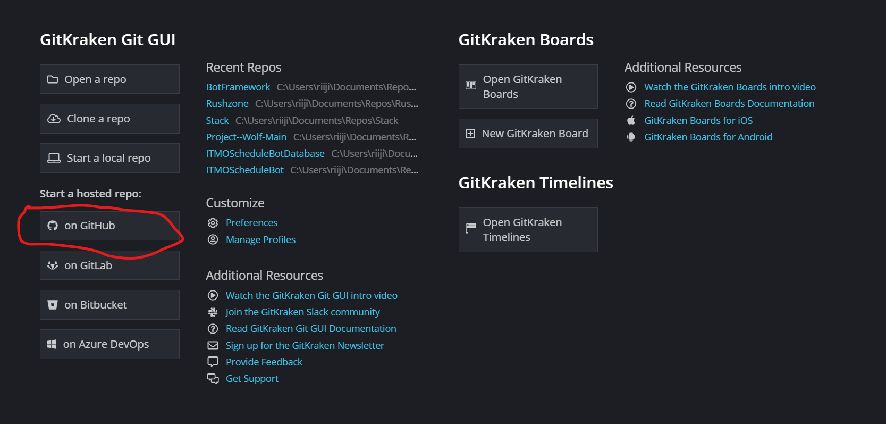
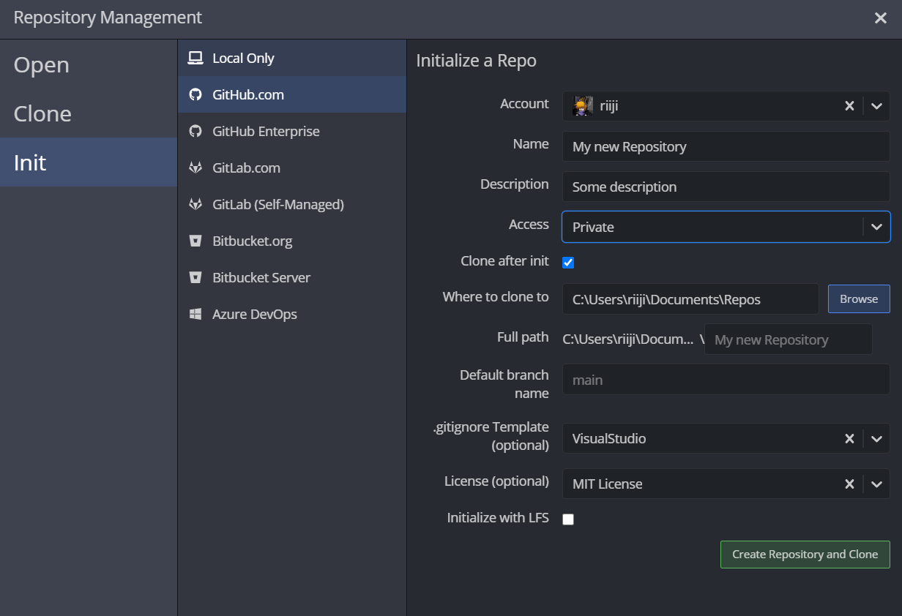
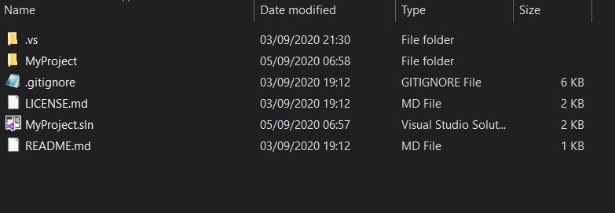
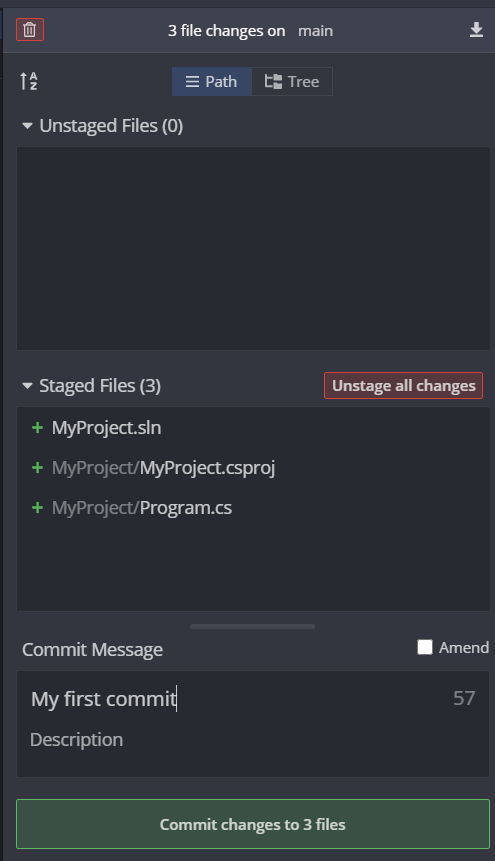

# Работа с GitKraken + Github: Для самых маленьких

Что такое Git?

Git - система контроля версий, Github - соцсеть для программистов, тут же можно легко передавать, хранить и получать самую актуальную информацию

Для новичков я рекомендую использовать **GUI GitKraken** (https://www.gitkraken.com/), этот тот же консольный Git, но только в красивой и интуитивно понятной оболочке

Для работы с Git первым делом необходимо создать репозитории, конечно же, буду показывать на примере GitKraken, но в других GUI или в консольном Git'e будет тоже самое

Далее нам необходимо выбрать Github и создать наш репозитории, **обратите внимание на настройки доступа**. Закрытый репозиторий (private), открытый (public). Также стоит обратить на **gitignore файл**, он должен соответствовать вашей **среде разработки**, в моем случае, Visual Studio. 

.gitignore - специальный файл для Git, он говорит Git'y, какие файлы отслеживать не надо, чтобы лишние файлы оставались на вашем компьютере, а то что действительно необходимо, было на репозитории

Кидаем проект в **папку с репозиторием**, папка должна выглядеть примерно так

В самом GitKraken'e справа **должны появиться изменения**, из всех файлов важными оказались только 3, значит gitignore сработал правильно, называем и делаем commit

Ну вот мы и пришли к последнему этапу, дело в том что при создании коммита, мы никуда ничего не отправили, изменения сохранились только на нашем локальном компьютере, то есть никаких изменений в репозитории на Github'e мы не внесли, для того чтобы наши изменения появились в репозиторие на Github'e, необходимо в клиенте GitKraken'a нажать кнопку **Push.**

На этом всё, далее вы можете поработать над вашим проектом, GitKraken будет сам отслеживать изменения в коде, необходимо только делать Commit+Push, для обновления информации на Github

## Альтернативный способ:

Конечно же, есть и другие способы создания репозитория, например, можно создать проект в visual studio с локальным гитом
(мануал как это сделать https://vk.cc/azdQtZ)

Далее открываем папку с проектом через GitKraken и делаем remote

Делаем уже привычные commit+push и наши файлы лежать на github

**Что почитать?**

https://support.gitkraken.com/start-here/guide/

https://rogerdudler.github.io/git-guide/ (микрогайд по консольному гиту)
