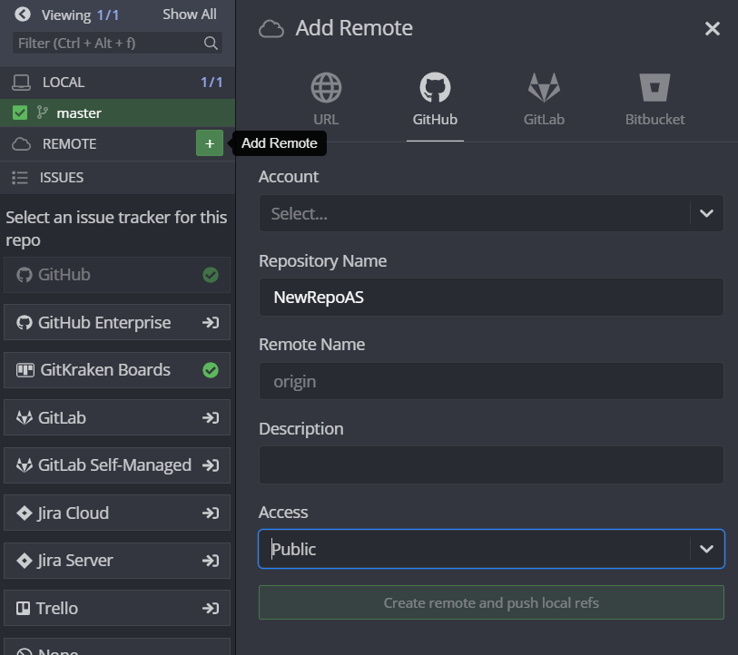

# Работа с Git + Github: Для самых маленьких

<!-- TABLE OF CONTENTS -->

 

<ol>
 <li><a href="#что-такое-git">Что такое Git?</a></li>
        <ul>
          <li><a href="#репозиторий">Репозиторий</a></li>
          <li><a href="#коммиты-и-комменты">Коммиты и комменты</a></li>
          <li><a href="#ветки-и-pull-request">Ветки и pull request</a></li>
          <li><a href="#gitignore">Немного о .gitignore</a></li>
        </ul>
  <li><a href="#варианты-работы-с-git">Варианты работы с Git</a></li>
        <ul>
          <li><a href="#gitkraken">GitKraken</a></li>
          <li><a href="#visual-studio">Visual Studio</a></li>
          <li><a href="#intellij-idea">Intellij idea</a></li>
        </ul>
  <li><a href="#что-почитать">Что почитать?</a></li>
</ol>

<!-- ABOUT THE GIT -->
## Что такое Git

Git - система контроля версий. С его помощью мы храним все версии редактируемых файлов и можем вернуться к любой сохраненной версии в любой момент времени. Кроме того, git поддерживает возможность использования одной системы контроля версий на проекте множеством разработчиков. 

Github - соцсеть для программистов: тут можно легко передавать, хранить и получать самую актуальную информацию.

## Репозиторий
Про подробное устройство репозитория и то, как он работает внутри можно почитать тут https://www.google.ru

Сам репозиторий представляет собой каталог файловой системы, в котором хранится ваш проект и вещи, необходимые ему для корректной работы. Репозитории бывают локальными (лежат у нас на компе) и удалёнными (например, лежат на Github). Эти репозитории связаны между собой, но изменения в одном из них не меняют другой автоматически. 

Отсюда следует вещь, о которой часто поначалу забывают -  ***если вы сделали коммит  и ушли спать не сделав push на удалённый репозиторий, ваш товарищ не получит никаких изменений и будет грустить***

Также, на Github есть деление на private и public репозитории. Public репозитории доступны всем желающим, а Private только вам, и тем, кому вы предоставите эту возможность.

Для управления репозиторием на Github необходимо перейти во вкладку Settings

Если вы хотите сделать репозиторий приватным\публичным или удалить его, скрольте вниз до Danger zone

Если вы хотите добавить кого то в приватный репозиторий, вам поможет вкладка manage access

## Коммиты и комменты
Итак, у нас имеется настоящий Git-репозиторий и рабочая копия файлов для некоторого проекта. Нам нужно делать некоторые изменения и фиксировать эти изменения в вашем репозитории каждый раз, когда проект достигает состояния, которое нам хотелось бы сохранить.

Каждая подобная фиксация является коммитом. 

Важно отметить, что у коммита есть название и описание. Не стоит называть коммиты "ааа" или "123" - гораздо лучше будет дать им ёмкое название, чтобы человеку работающему с проектом было легче понимать в каком коммите что произошло. 

Также не стоит пихать всё подряд в один огромный коммит - гораздо лучше разнести их на несколько поменьше, каждый из которых будет отвечать за то или иное изменение в проекте.

Пример хорошего коммита

Пример плохого коммита

## Ветки и pull request
Предположим, вы захотели добавить какую то фичу в проект. Казалось бы - пиши код, делай коммиты, если что откатимся. 
Вы как добропорядочный программист фиксируете все изменения, пушите их на Github. Ваши товарищи тоже не сидят сложа руки, и каждый делает то же самое. Вы все работаете над разными задачами одного проекта, и ежечасно подгружаете чужие изменения, параллельно  добавляя свои. 
И вдруг, в какой то момент, вы понимаете, что ваша фича не работает и всё очень плохо, и лучше бы вернуть всё как было... Но вот незадача - помимо ваших изменений откатятся и изменения других людей, а там всё было хорошо.

Именно для этого в git используют ветки. Основная ветка называется master\main и там хранится текущая версия проекта, где всё точно работает как надо. Помимо главной ветки проекта мы можем добавлять новые "ответвления", для решения каких либо задач. Между ветками можно переключаться (об этом чуть позднее), так что если все ваши изменения куда то пропали - возможно вы просто находитесь в другой ветке. С помощью этого механизма каждая задача может решаться независимо от других, а после того как мы убедимся, что она решена, мы можем снова соединить нашу ветку и master. 

Однако все мы иногда допускаем ошибки. Поэтому прежде чем слить все наши изменения в master, неплохо было бы, чтобы кто-то проверил чего мы там наковыряли. Когда вы сделаете push находясь в новой ветке, Github автоматически создаст pull request, где ваши изменения могут посмотреть, исправить, или оставить какие то комментарии к ним, прежде чем они будут слиты в master. Кроме того, все изменения, которые вы запушите из той же ветки, будут так же попадать в этот пулл реквест до тех пор, пока он не закроется. (Иными словами, если вы открыли pull request, вам сказали что нужно поправить пару деталей - смело поправляейте и жмите push, все изменения автоматически попадут в этот pull request)
Выглядит это примерно вот так:

## gitignore
.gitignore - специальный файл для Git. Он говорит Git'y, какие файлы отслеживать не надо, чтобы лишнее оставалось на вашем компьютере, а то, что действительно необходимо, было в репозитории. Обычно IDE формирует этот файл самостоятельно.

## Варианты работы с Git
Для новичков я рекомендую использовать **GUI GitKraken** (https://www.gitkraken.com/), это тот же консольный Git, но только в красивой и интуитивно понятной оболочке. Однако при желании можно воспользоваться встроенными средствами IDE.

### GitKraken
Для работы с Git первым делом необходимо создать репозиторий.

Далее нам необходимо выбрать Github и создать наш репозиторий. **Обратите внимание на настройки доступа**: закрытый репозиторий (private) и открытый (public). Также стоит обратить внимание на **gitignore файл**, он должен соответствовать вашей **среде разработки** (в моём случае - Visual Studio). 

Не забываем о .gitignore!

Кидаем проект в **папку с репозиторием**, папка должна выглядеть примерно так

В самом GitKraken'e справа **должны появиться изменения**, из всех файлов важными оказались только 3, значит gitignore сработал правильно, называем и делаем commit

Ну вот мы и пришли к последнему этапу: дело в том, что при создании коммита мы никуда ничего не отправили, изменения сохранились только на нашем локальном компьютере, то есть никаких изменений в репозиторий на Github'e мы не внесли. Для того, чтобы наши изменения появились в репозиторие на Github'e, необходимо в клиенте GitKraken'a нажать кнопку **Push.**

На этом всё, далее вы можете работать над вашим проектом. GitKraken будет сам отслеживать изменения в коде, необходимо только делать Commit+Push для обновления информации на Github

## Альтернативный способ:

Конечно же, есть и другие способы создания репозитория. Например, можно создать проект в Visual Studio с локальным гитом
(мануал как это сделать https://vk.cc/azdQtZ)

Далее открываем папку с проектом через GitKraken и делаем remote

Делаем уже привычные commit+push, и наши файлы теперь лежат на github

### Visual Studio
Итак, по какой либо причине вы отказались от удобного UI и решили пользоваться встроенными средствами Visual Studio.
Вы работали над проектом и в какой то момент решили добавить git репозиторий? Нет проблем - жмите на эту кнопку (да у автора русская Visual Studio, и да, однажды, он это исправит)

После этого вам будет предложено выбрать его настройки приватности, имя и месторасположение. Кроме того, если вы синхронизировались со своим аккаунтом на Github, у вас будет возможность автоматически создать репозиторий и там.

Кроме того, в "шапке" доступна следующая вкладка. В ней мы можем сделать коммит, запушить изменения на Github, получить чужие изменения и перейти в управление ветками 

 

После клика на "фиксация"\"commit" открывается следующее окошко. В нём мы и создаем наш коммит, после чего его можно запушить, нажав на соответствующую кнопку.

### Intellij idea
При создании проекта в Intellij idea вам будет предложено автоматически создать git репозиторий. Если не ставить галочку, это можно будет сделать позднее во вкладке git.

Для взаимодействия с git-oм непосредсвенно изнутри IDE нам понадобятся следующие кнопки. 
Синяя стрелочка (Pull) - выгрузить изменения из удалённого репозитория.
Зелёная галочка (Commit) - сделать коммит.
Зелёная стрелочка (Push) - запушить коммит на удалённый репозиторий.

Кроме того, Intellij idea предоставляет относительно удобную работу с ветками, если вы по каким то причинам не хотите устанавливать Gitkraken. После клика на Branches во вкладке Git перед нами появится следующее окошко, в котором мы можем создавать новые ветки (New branch), переходить между ветками (Checkout branch) и делать прочие непотребства

Также, по клику на вкладку Git в правом нижнем углу экрана (она появится только если у вас уже есть Git репозиторий), можно открыть окошко с отрисовкой веток, и возможностью перемещения по коммитам.

## Что почитать

https://support.gitkraken.com/start-here/guide/

https://rogerdudler.github.io/git-guide/ (микрогайд по консольному гиту)
