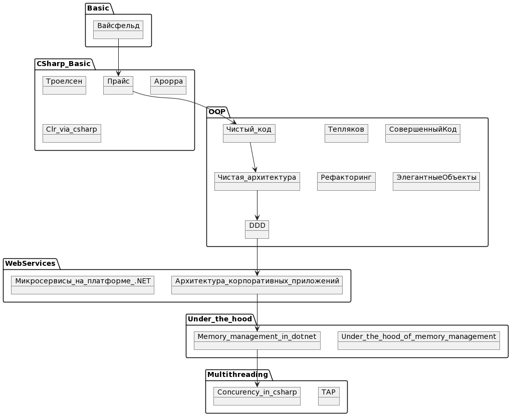

# Books

Небольшая подборка книг, которые мы можем порекомендовать к ознакомлению.

## Гайд про прохождению списка литературы секты

## Basic

- "Вайсфельд М. Объектно-ориентированный подход" - Данная книга проходит с читателем от самых базовых понятий в мире ООП, формирует представление о том, как нужно работать с типами, их анатомию. Также книга содержит информацию про паттерны проектирования и SOLID.

## C# general

- "Mark J. Price - C# 10 and .NET 6" - Книга за несколько изданий превратилась из обзорника платформ и фреймворков в полноценный учебник по изучению мира C#. В ней рассмотрены как базовый функционал языка, так и часто используемые библиотеки - LINQ, EF, ASP.
- "Троелсен Э. Язык программирования C# 7 и платформы .NET и .NET Core" - Одна из самых известных книг по языку C#. В ней довольно детально рассказывают про многие базовые аспекты C#/.NET. И это как хорошо, так и плохо. С одной стороны - после прочтения сложиться общее понимание как все устроено и таких знаний хватит довольно надолго. Но детально в этой книге рассказывают также таки вещи как CLR, и читатель впервые начинает читать про синтаксис языка C# где-то спустя 100 страниц. К этому времени уже можно решить, что C# не твое. Так что советую очень правильно выбирать с какой главы начинать знакомство.
- "Арораа Г. Паттерны проектирования для C# и платформы .NET Core" - Паттерны проектирования для C# и платформы .NET Core. Более .NET-ориентированная книга, которая не только рассказывает про теорию ООП, но и показывает, как она представлена в реальных инструментах. Содержит довольно много практических аспектов, а не только теорию по ООП.
- "Албахари Джозеф - C# 9.0. Справочник. Полное описание языка" - Книга где есть вся нужная информация, чтобы начать понимать C#. Но даже из названия можно понять, что это не книга для прочтения, а справочник. К ней рекомендуется обращаться, когда нужно подробно рассмотреть определенную тему.
- "C# Notes for professionals" - Это даже не книга, а скорее подборка примеров кода на C# на совершенно различные случаи начиная от синтаксиса операторов и заканчивая сериализацией, кодогенирацией и криптографией. Знакомиться в таком формате с языком можно только при условии, что есть полное понимание того, как работает какой-то схожий язык и хочется быстро сменить синтаксис с Java на C#.
- "Рихтер Дж. CLR via C#" - Та самая классика, где рассказывают все (но это не точно), что нужно знать разработчику, чтобы C# не был для него магией. Книга приоткрывает занавес, пытаясь показать читателю как .NET понимает код, которые он пишет.
- "Скит Дж. C# для профессионалов. Тонкости программирования" - Отличная книга, в которой рассказывается об истории языка, о том как реализованы различные механизмы и почему именно так. Отличный способ пересмотреть свой взгляд на привычные вещи в C#.
- "Фримен А. LINQ для профессионалов" - Все что нужно знать про LINQ и много больше. Эта книга не только расскажет как правильно использовать LINQ, но и также может вдохновить вам на использование Fluent-интерфейсов в проектировании своей архитектуры.

## Object oriented design (basic)

- "Тепляков С. Паттерны проектирования на платформе .NET" - Скорее всего, самая популярная книга про паттерны в мире .NET. Хорошо изложенная теория, которая подкрепляется практикой. Что еще нужно? Но не стоит накидываться и читать от корки до корки. Все же, паттерны - это ситуативная вещь. К этой книге стоит прибегать только когда вы точно решили, что нужно использовать определенный подходи и хотите узнать больше о нем.
- "Макконнелл С. Совершенный код" - Совершенный код - это первая книга, в которой я увидел мысль, что "Программирование - это не только про написание кода". И правда, одна из первых глав - это рассказ о том, как важны в разработке метафоры и как их правильно использовать. Данная книга поможет изменить подход к инструментам, которые вы используете (например, ваш язык программирования - это тоже инструмент), но стоит брать во внимание, что выгода от прочтения прям пропорциональная вашему уровню знаний на момент начала чтения.
- "Фаулер М. Рефакторинг. Улучшение проекта существующего кода" - В этой книге собраны идеи и подходы к написанию кода, поднимается вопрос "А хороший ли этот код?".
- "Мартин Р. Чистый код"

## Object oriented design (advanced)

- "Вернон В.. Domain driven design" - Вернон В.. Domain driven design
- "Мартин Р. Чистая архитектура" - Книга, которая указывает на различные аспекты при проектировании. Мастхев для прочтения
- "Бугаенко Е. Элегентные объекты"
- "Фаулер М. Архитектура корпоративных программных приложений"
- "Симан М. Внедрение зависимостей в .NET"

## Multithreading

- "Toub St. The Task-based Asynchronous Pattern"
- "Клири Ст. Конкурентность в C#"

## Under the hood

- "Уотсон Б. Высокопроизводительный код на платформе .NET"
- "Кокоса К. Управление памятью в .NET для профессиронало"
- "Farrell Ch. Under the Hood of  .NET Memory Management"

## Other

- "Фаулер М. UML Основы" - Язык UML - это де-факто стандарт графического описания систем. Он очень удобен для визуализации вашей архитектуры и поможет сократить часы на объяснения другому человеку логики работы вашего кода.
- "Милевски Б. Теория категорий для программистов"
